本章先来了解下 NeteaseCloudMusicApi 这个项目，并且我提前把 NeteaseCloudMusicApi 项目 fork 到了 [uniapp-music-back-code][] ，方便后续接口二次开发和部署。

## NeteaseCloudMusicApi 项目

NeteaseCloudMusicApi，网易云音乐 NodeJS 版 API。

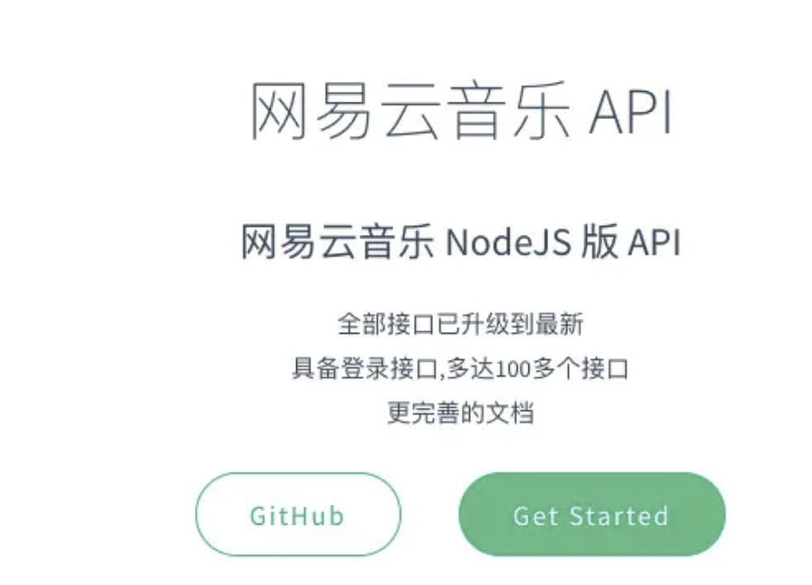

### 在线文档

[front-end-class.github.io/uniapp-musi…][front-end-class.github.io_uniapp-musi]

### 安装

    $ git clone https://github.com/front-end-class/uniapp-music-back-code.git
    $ npm install

### 运行

    $ node app.js

服务器启动默认端口为 3000,若不想使用 3000 端口,可使用以下命令: Mac/Linux

    $ PORT=4000 node app.js

windows 下使用 git-bash 或者 cmder 等终端执行以下命令:

    $ set PORT=4000 && node app.js

成功启动打开浏览器访问：

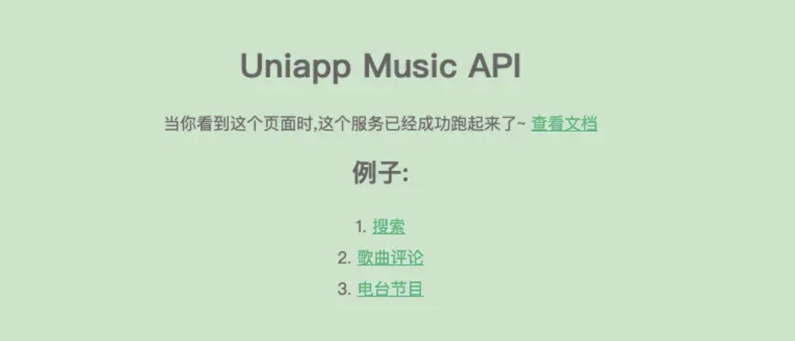

### 接口二次开发

使用 NeteaseCloudMusicApi 项目可以友好的使用网易云的接口，但是还是需要注意一些接口问题。毕竟网易云并没有把 app 应用的接口暴露出来，在 Uniapp 项目中使用特定业务的接口就需要数据模拟来完成了。

NeteaseCloudMusicApi 项目中的 app.js 处理接口是根据文件夹 module 下的文件名称进行接口定义的。比如 banner.js 文件里面处理了网易云的接口再二次转发到客户端。

这样客户端访问 localhost:3000/banner 接口就可以访问到数据了。相关代码：

    // app.js
    // 读取 module 目录下的所有文件
    fs.readdirSync(path.join(__dirname, 'module')).reverse().forEach(file => {
        if (!file.endsWith('.js')) return
    	// 提取文件的名称
        let route = (file in special) ? special[file] : '/' + file.replace(/\.js$/i, '').replace(/_/g, '/')
    	// 文件的请求promise
        let question = require(path.join(__dirname, 'module', file))

    	// 以文件名称作为接口路径
        app.use(route, (req, res) => {
            let query = Object.assign({}, req.query, req.body, { cookie: req.cookies })
    		// 处理请求响应
            question(query, request).then(answer => {
                res.append('Set-Cookie', answer.cookie)
                res.status(answer.status).send(answer.body)
            }).catch(answer => {
                if (answer.body.code == '301') answer.body.msg = '需要登录'
                res.append('Set-Cookie', answer.cookie)
                res.status(answer.status).send(answer.body)
            })
        })
    })

以上面代码处理作为引导，我们可以在目录下新建一个 mock 文件夹处理模拟数据，也是以文件命名的方式作为接口名。以上面代码的重新改造即可。

_注：NeteaseCloudMusicApi 项目是基于 express 开发_

项目存在跨域的可能性，express 有一个 npm 模块 cors 处理跨域问题，使用非常简洁方便。

安装模块

    npm i cors -D

模块使用

    const express = require('express');
    const cors = require('cors');
    const app = express();

    app.use(cors());

注：添加中间件要注意顺序。

看一下 app.js 完整代码：

    const fs = require('fs')
    const path = require('path')
    const express = require('express')
    const bodyParser = require('body-parser')
    const request = require('./util/request')
    const packageJSON = require('./package.json')
    const exec = require('child_process').exec
    const cache = require('apicache').middleware
    const cors = require('cors');

    // version check
    exec('npm info NeteaseCloudMusicApi version', (err, stdout, stderr) => {
        if (!err) {
            let version = stdout.trim()
            if (packageJSON.version < version) {
                console.log(`最新版本: ${version}, 当前版本: ${packageJSON.version}, 请及时更新`)
            }
        }
    })

    const app = express()

    app.use(cors());

    // CORS & Preflight request
    app.use((req, res, next) => {
        if (req.path !== '/' && !req.path.includes('.')) {
            res.set({
                'Access-Control-Allow-Credentials': true,
                // 'Access-Control-Allow-Origin': req.headers.origin || '*',
                'Access-Control-Allow-Origin': '*',
                'Access-Control-Allow-Headers': 'X-Requested-With,Content-Type',
                'Access-Control-Allow-Methods': 'PUT,POST,GET,DELETE,OPTIONS',
                'Content-Type': 'application/json; charset=utf-8'
            })
        }
        req.method === 'OPTIONS' ? res.status(204).end() : next()
    })

    // cookie parser
    app.use((req, res, next) => {
        req.cookies = {}, (req.headers.cookie || '').split(/\s*;\s*/).forEach(pair => {
            let crack = pair.indexOf('=')
            if (crack < 1 || crack == pair.length - 1) return
            req.cookies[decodeURIComponent(pair.slice(0, crack)).trim()] = decodeURIComponent(pair.slice(crack + 1)).trim()
        })
        next()
    })

    // body parser
    app.use(bodyParser.json())
    app.use(bodyParser.urlencoded({ extended: false }))

    // cache
    app.use(cache('2 minutes', ((req, res) => res.statusCode === 200)))

    // static
    app.use(express.static(path.join(__dirname, 'public')))

    // router
    const special = {
        'daily_signin.js': '/daily_signin',
        'fm_trash.js': '/fm_trash',
        'personal_fm.js': '/personal_fm'
    }

    // mock 本地数据
    fs.readdirSync(path.join(__dirname, 'mock')).reverse().forEach(file => {
        if (!file.endsWith('.js')) return
        let route = (file in special) ? special[file] : '/' + file.replace(/\.js$/i, '').toLowerCase().replace(/_/g, '/')
        let question = require(path.join(__dirname, 'mock', file))

        app.use(route, (req, res) => {
            // res.status(200).send(question)
            let query = Object.assign({}, req.query, req.body, { cookie: req.cookies })
            question.promise(query, request).then(answer => {
                console.log('[OK]', decodeURIComponent(req.originalUrl))
                console.log(answer)
                res.append('Set-Cookie', answer.cookie)

                answer.body.mock = question.mock
                res.status(answer.status).send(answer.body)
            }).catch(answer => {
                console.log('[ERR]', decodeURIComponent(req.originalUrl))
                if (answer.body.code == '301') answer.body.msg = '需要登录'
                res.append('Set-Cookie', answer.cookie)
                res.status(answer.status).send(answer.body)
            })

            return
        })
    })

    fs.readdirSync(path.join(__dirname, 'module')).reverse().forEach(file => {
        if (!file.endsWith('.js')) return
        let route = (file in special) ? special[file] : '/' + file.replace(/\.js$/i, '').replace(/_/g, '/')
        let question = require(path.join(__dirname, 'module', file))

        app.use(route, (req, res) => {
            let query = Object.assign({}, req.query, req.body, { cookie: req.cookies })
            question(query, request).then(answer => {
                console.log('[OK]', decodeURIComponent(req.originalUrl))
                res.append('Set-Cookie', answer.cookie)
                res.status(answer.status).send(answer.body)
            }).catch(answer => {
                console.log('[ERR]', decodeURIComponent(req.originalUrl))
                if (answer.body.code == '301') answer.body.msg = '需要登录'
                res.append('Set-Cookie', answer.cookie)
                res.status(answer.status).send(answer.body)
            })
        })
    })

    const port = process.env.PORT || 3000

    app.server = app.listen(port, () => {
        console.log(`server running @ http://localhost:${port}`)
    })

    module.exports = app

## 注册腾讯云和安装软件

1.  注册腾讯云和申请域名，这里按照官方指导操作就可以
2.  我选的系统是 CentOS 7.5 64 位，申请完登录，进入腾讯云，

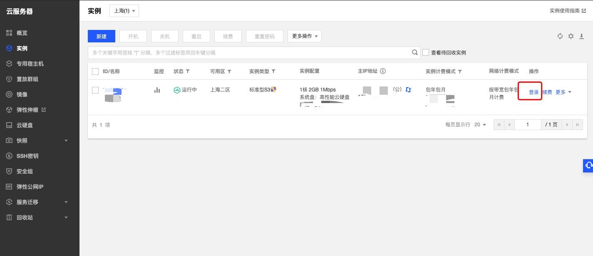

选择标准方式`登录`，密码注册时已发`消息中心`里，建议修改密码

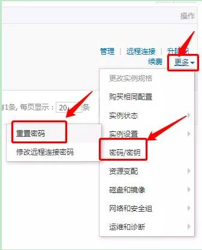

登录成功

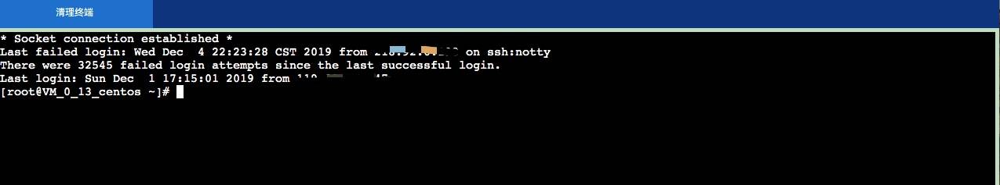

接下来依次键入命令安装几个软件：

- Node.js
- pm2
- nginx

  yum install -y nodejs
  yum install -y git
  yum install -y nginx

Node.js 安装完成就可以使用 npm 安装 pm2

    npm install pm2 -g

pm2 是 node 进程管理工具，可以利用它来简化很多 node 应用管理的繁琐任务，如性能监控、自动重启、负载均衡等，而且使用非常简单。pm2 功能很强大，入门确非常简单，常用的几个命令是：

    pm2 start app.js -n uni 启动一个进程并把它命名为 uni
    pm2 list/ls 列出所有进程信息
    pm2 logs 显示所有进程日志
    pm2 stop all 停止所有进程
    pm2 restart all 重启所有进程
    pm2 reload all 0秒停机重载进程 (用于 NETWORKED 进程)
    pm2 stop 0 停止指定的进程
    pm2 restart 0 重启指定的进程
    pm2 startup 产生 init 脚本 保持进程活着
    pm2 delete 0 杀死指定的进程
    pm2 delete all 杀死全部进程
    pm2 monit 查看进程的资源消耗情况
    pm2 start app.js -i max // -i 表示 number-instances 实例数量 max 表示 PM2将自动检测可用CPU的数量 可以自己指定数量
    pm2 start app.js -n uni --watch 在文件改变的时候会重新启动程序
    pm2 startup centos 设置pm2开机自启
    pm2 save 保存设置

了解更多可以查看 [官方文档][link 1]。

## 部署项目至腾讯云

首先拉取一份代码到本地 [uniapp-music-back-code][]，然后回到腾讯云后台并输入：

    git clone https://github.com/front-end-class/uniapp-music-back-code.git
    #之后需要更新可以输入命令：git pull

    # 进入文件夹
    cd uniapp-music-back-code

    # 安装npm包
    npm install

    # 使用pm2启动
    pm2 start app.js -n uni

    # 查看状态
    pm2 list

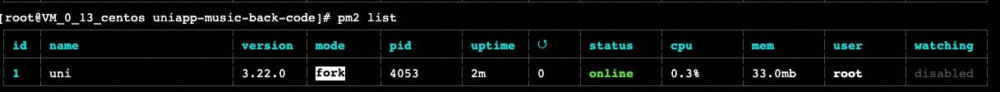

已经启动成功，打开浏览器通过域名或 ip（公网 ip） 访问。

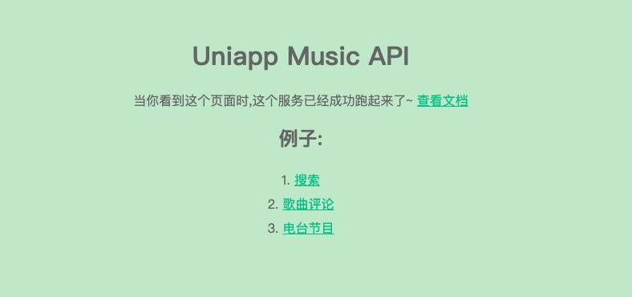

## 安装 Shell 软件

对于操作后台管理系统，更多人会选择可视化的软件。Windows 系统一般推荐就是 Xshell，对于 Mac 系统的，我使用 FinalShell（支持国产的，也没找到更傻瓜的）。 也是一路安装，然后配置（Xshell 也是类似操作）：

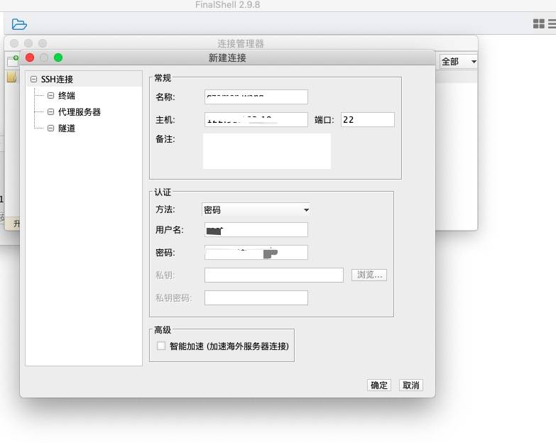

登录成功之后：

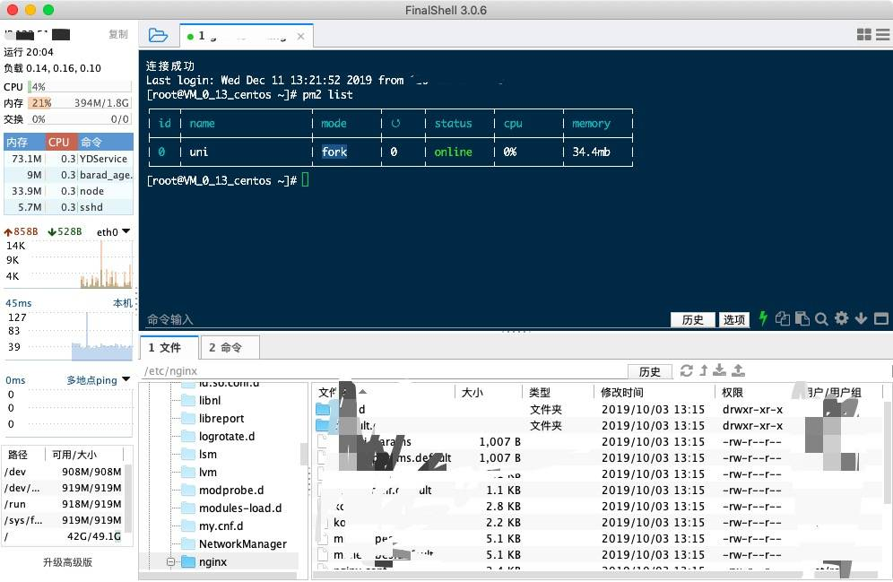

尝试输入：

    pm2 list
    # 出现上文启动的 uni 项目日志

## 配置 Https

众所周知，小程序接口需要使用 https，我们可以利用腾讯云提供的免费 [SSL 证书][ssl] 来配置 https，点击免费申请按钮，选择域名型的（DV）免费证书即可：

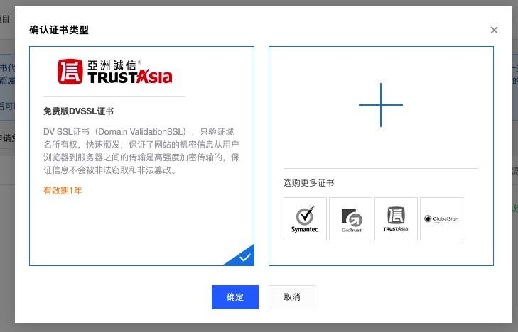

填上申请信息后，等待大概半小时，证书就能申请下来。

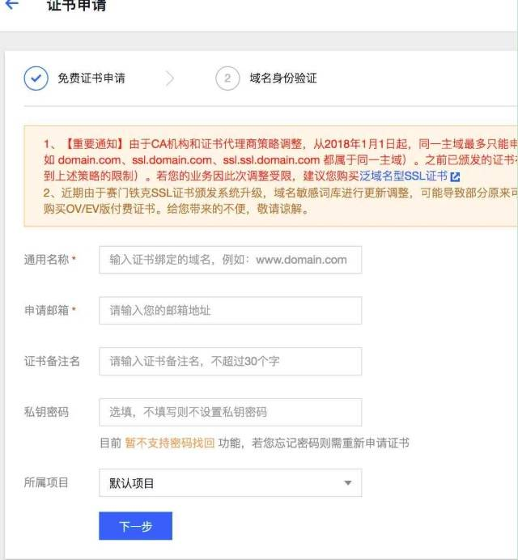

在证书申请通过后，进入 SSL 证书列表，将所申请的域名 SSL 证书下载到本地后，再上传到域名所在服务器。

回到 FinalShell，在 `/etc/nginx/` 下创建文件夹 ssl

    # 也可以选择输入命令
    cd /etc/nginx/
    mkdir ssl

将 crt 和 key 两个文件(公钥和私钥)修改好名字上传到 ssl 文件夹

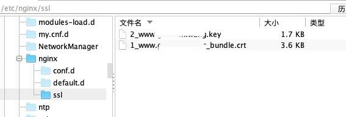

修改 nginx 配置文件

    vi /etc/nginx/nginz.conf

修改 server 配置

    server{
          listen 80;    #表示监听80端口
          server_name gzamon.wang www.gzamon.wang;
          location / {    #将80端口强制转为https
              rewrite (.*) https://www.gzamon.wang$1 permanent;
          }
    }
    server{
          listen 443 ssl;    #表示监听443端口即https
          server_name gzamon.wang www.gzamon.wang;
          ssl_certificate /etc/nginx/ssl/1_www.gzamon.wang_bundle.crt;   #证书公钥文件路径
          ssl_certificate_key /etc/nginx/ssl/2_www.gzamon.wang.key;      #证书私钥文件路径
          ssl_session_timeout 5m;                                         #5分钟session会话保持
          ssl_protocols TLSv1 TLSv1.1 TLSv1.2;
          ssl_ciphers ECDHE-RSA-AES128-GCM-SHA256:HIGH:!aNULL:!MD5:!RC4:!DHE;
          ssl_prefer_server_ciphers on;

          location / {    #将80端口强制转为https
            root /home/nginx/uni-music;  # H5 打包后项目放置目录
            #固定写法就可以了
            index  index.html index.htm;
            try_files $uri $uri/ /index.html;
          }

          location /api/ {
              proxy_pass http://127.0.0.1:3000/; # node后端接口服务
              proxy_redirect   off;
              proxy_set_header Host $host;
              proxy_set_header X-Real-IP $remote_addr;
              proxy_set_header X-Forwarded-For $proxy_add_x_forwarded_for;
              proxy_set_header X-Forwarded-Proto $scheme;
        }
    }

保存并重启 nginx

    sudo service nginx restart

如果报错：

    Job for nginx.service failed because the control process exited with error code. See "systemctl status nginx.service" and "journalctl -xe" for details.
    # 输入 systemctl status nginx.service 会提示是什么错误，修复后再次重启 nginx 即可

如果没有报错你就可以使用 https 访问网站了 ：）

演示地址： [uni-music][] [api 接口服务][api]

参考文档：

- (域名型证书申请流程)\[[cloud.tencent.com/document/pr…][cloud.tencent.com_document_pr]\]
- (腾讯云实现全站 HTTPS 方案)\[[cloud.tencent.com/document/pr…][cloud.tencent.com_document_pr 1]\]

## 通过 Docker 部署

### 安装 Docker

首先在腾讯云上安装 Docker，参照官方极简教程，成功是分分钟事，[搭建 Docker 环境][docker]。

要知道是否安装成功，执行命令：

    docker -v

![img][img 10]

代表安装成功。

### Dockerfile 文件

Dockerfile 是个关键，它包含各种执行指令，Docker 能够读取 Dockerfile 的指定进行自动构建容器。

在项目根目录新建 Dockerfile，执行命令：

    touch Dockerfile

放入以下代码：

    FROM mhart/alpine-node:9

    WORKDIR /app
    COPY . /app

    RUN rm -f package-lock.json \
        ; rm -rf .idea \
        ; rm -rf node_modules \
        ; npm config set registry "https://registry.npm.taobao.org/" \
        && npm install

    RUN npm install pm2 -g

    EXPOSE 3000
    CMD ["pm2-runtime", "start", "app.js", "-n", "uni-docker"]

这个文件包含了以下命令：

- FROM mhart/alpine-node:9 - 指定使用最新版本的 node 基础镜像
- WORKDIR /app - 将容器内工作目录设置为/app
- COPY . /app - 将宿主机当前目录下内容复制到镜像/app 目录下
- RUN rm / RUN npm install - 删除文件，设置 npm 源，再执行 npm install 安装应用所需的包
- EXPOSE 3000 - 对外开放容器的 3000 端口
- CMD \["pm2-runtime", "start", "app.js", "-n", "uni-docker"\] - 在容器启动时，执行的命令，通过 pm2 来统一管理应用

### 构建镜像

编写完 Dockerfile 文件后，就可以通过 `docker build` 命令来构建镜像：

    sudo docker build -t uni-back .

![img][img 11]

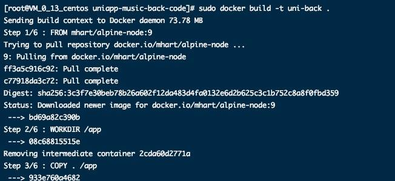

等待构建成功，执行命令查看：

    docker images

![img][img 12]

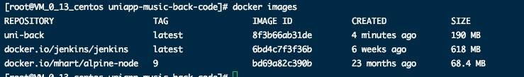

### 运行容器

镜像构建完成后，就可以通过 `docker run` 运行容器，从而实现应用的 docker 化部暑。

执行命令：

    sudo docker run -d --name uni-back -p 3000:3000 uni-back

![img][img 13]

代表启动成功，通过你的域名+/api/ 访问。

### 查看状态

记得上面说得 `pm2 list` 来查看应用信息，在 docker 里查看命令需换成 `docker exec`：

    docker container ls -a  #查看容器信息，例如 CONTAINER ID
     docker exec -it CONTAINER ID pm2 list

![img][img 14]

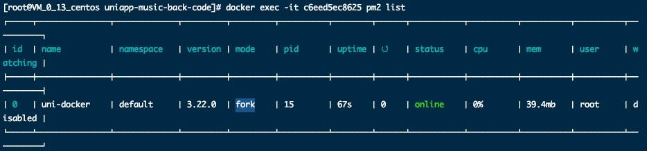

uni-docker 运行一切良好，部署完成。

## Serverless

目前市面流行有另一种方案 —— Serverless，我在之前项目中分别使用过 Leancloud，小程序云开发和知晓云，重点在于编写云函数，提交部署，前端结合相关的 SDK 调用各自线上的服务，以操作后台的增删改查，对于简单的项目是非常便利的，可以做到快速集成上线，对于不熟悉后端的同学省去了搭建后端服务的时间。

最新版 HBuilderX 已经支持云开发，详细点击 [uniCloud][] 了解，后续我会尝试加入相关代码。

## 小结

1.  本章通过注册开通腾讯云，安装 Shell 软件，搭建云服务，编写 nginx，配置 https，基于 NeteaseCloudMusicApi 部署项目接口。如果你跟着一步步操作，会发现当前的云服务部署相比以前的购买空间（服务器）部署，那是相当简易了。
2.  本章代码 [uniapp-music-back-code][]。

[uniapp-music-back-code]: https://github.com/front-end-class/uniapp-music-back-code
[image-20210215160547033]: https://s.poetries.work/images/image-20210215160547033.png
[front-end-class.github.io_uniapp-musi]: https://front-end-class.github.io/uniapp-music-back-code/
[image-20210215160559284]: https://s.poetries.work/images/image-20210215160559284.png
[img]: https://s.poetries.work/images/16f0e2ba26392d06.jpeg
[img 1]: https://s.poetries.work/images/16f0e2c039f347b4.jpeg
[img 2]: https://s.poetries.work/images/16f0e2c43574a011.jpeg
[link 1]: http://pm2.keymetrics.io/docs/usage/quick-start
[img 3]: https://s.poetries.work/images/16f0e2cf41d39a44.jpeg
[img 4]: https://s.poetries.work/images/16f0e2d23894bb5e.jpeg
[img 5]: https://s.poetries.work/images/16f0e2de534eac5e.jpeg
[img 6]: https://s.poetries.work/images/16f0e2e31f41f14b.jpeg
[ssl]: https://console.cloud.tencent.com/ssl
[img 7]: https://s.poetries.work/images/16f0e2e66cf7914b.jpeg
[img 8]: https://s.poetries.work/images/16f0e2e90b3cc88b.jpeg
[img 9]: https://s.poetries.work/images/16f0e2eee37e98f6.jpeg
[uni-music]: https://www.gzamon.wang/
[api]: https://www.gzamon.wang/api/
[cloud.tencent.com_document_pr]: https://cloud.tencent.com/document/product/400/6814
[cloud.tencent.com_document_pr 1]: https://cloud.tencent.com/document/product/400/6813
[docker]: https://cloud.tencent.com/developer/labs/lab/10054
[img 10]: https://s.poetries.work/images/17106178ce21ebc0.jpeg
[img 11]: https://s.poetries.work/images/171061734823539d.jpeg
[img 12]: https://s.poetries.work/images/1710617043a9db24.jpeg
[img 13]: https://s.poetries.work/images/1710616ba45059a9.jpeg
[img 14]: https://s.poetries.work/images/171061608f01a79e.jpeg
[unicloud]: https://uniapp.dcloud.io/uniCloud/README
