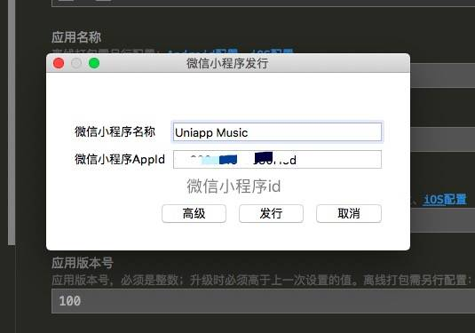
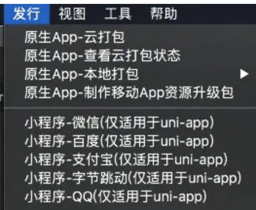
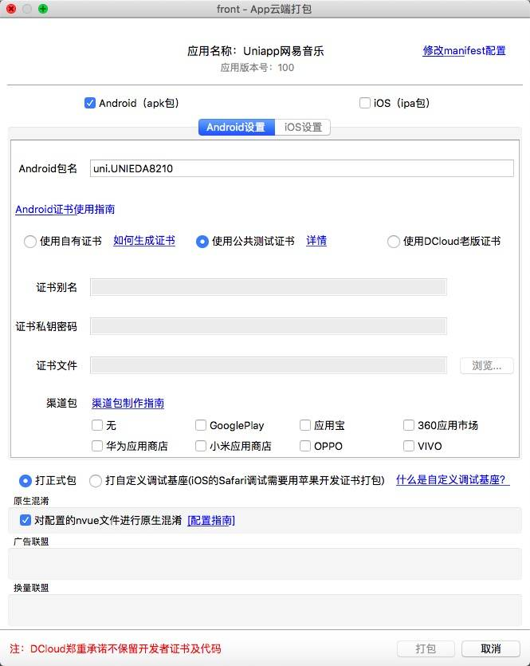
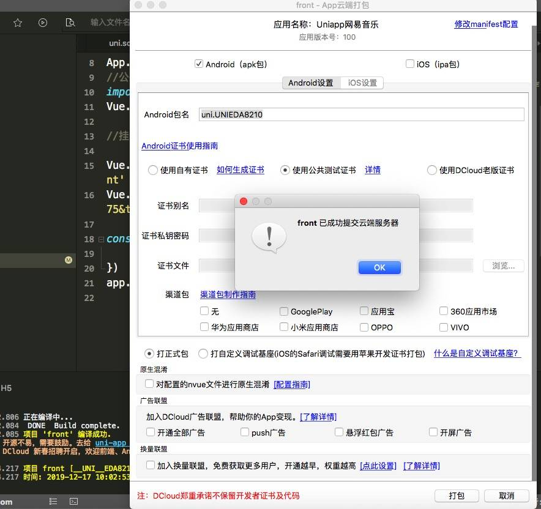
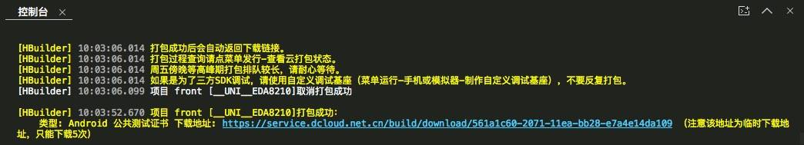
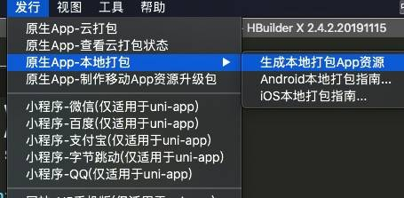
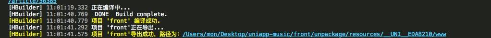
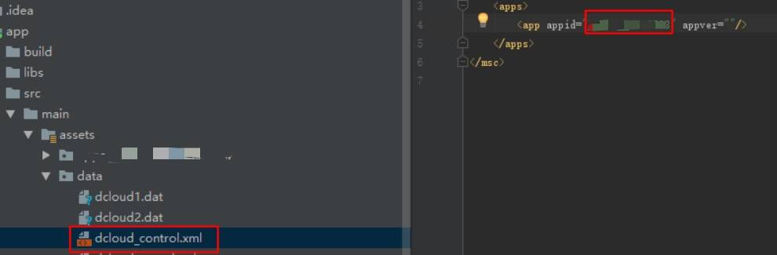
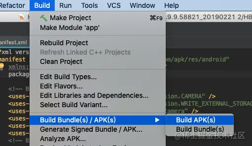
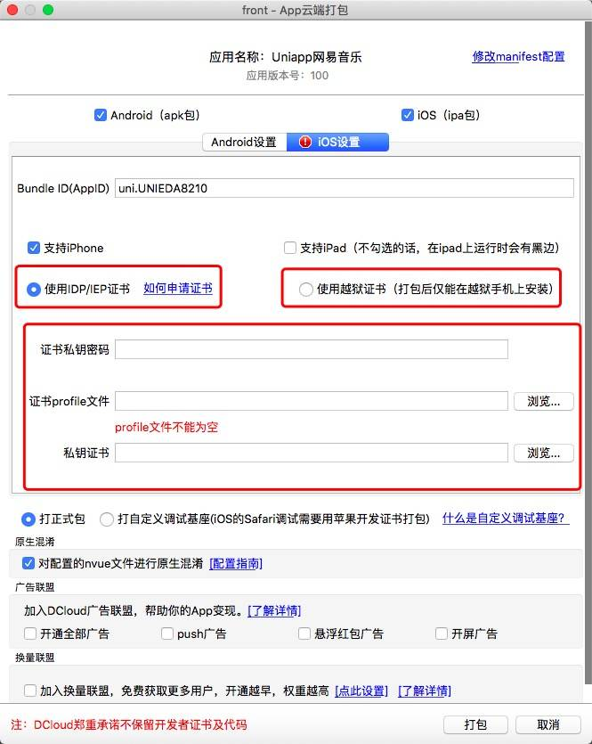

---

## sidebarDepth: 3

到这里，音乐项目基本门面是有了（添砖加瓦的事留给有兴趣的朋友，自己动动手指），把东西分享到社区让大伙使(zhao)用(cha)，想想就兴奋。本章我简单谈谈如何发布为三端应用：微信小程序，安卓 app 和 ios app。

## 微信小程序发布

1.  申请微信小程序 AppID，参考：[微信教程][link 1]；
2.  在 HBuilderX 中顶部菜单依次点击 "发行" => "小程序-微信"，输入小程序名称和 AppID 点击发行即可在 `unpackage/dist/build/mp-weixin` 生成微信小程序项目代码；

1.  在微信小程序开发者工具中，导入生成的微信小程序项目，测试项目代码运行正常后，点击 "上传" 按钮，之后回到小程序后台按照 "提交审核" => "发布" 小程序标准流程，逐步操作即可，详细查看：[微信官方教程][link 2]

## 安卓 app 打包发布

### 云打包（个人应用推荐使用）

1.  工具栏，选择"原生 App-云打包"；

1.  弹出配置界面，勾选需要的平台 Android 或 ios；

1.  这里我选择"使用[公共测试证书][link 3]"演示，真正发行还是要选择"使用[自有证书][link 4]"，点击打包按钮；

1.  等待控制台，提示消息，成功后会出现下载地址，点击下载 .apk 文件，安装至手机即可。

### 本地打包（企业应用推荐使用）

1.  安装 [Android Studio][]，配置安卓开发环境；
2.  下载 DCloud 官方 [SDK][]；
3.  用 HBuilderX 生成本地打包文件；

1.  替换官方 SDK 里面的文件夹（HelloH5）为 "\_\_UNI\_\_EDA8210"（这里是我的 uniapp 应用标识，你的会不同）；
2.  修改配置文件；

> 返回 Android Studio 修改文件 dcloud_control.xml，修改 id 为打包资源的 manifest.json 的 id 值：

1.  打包`.apk`。

注：本地打包稍微复杂，如果打包不成功，建议详细参照以下资料再试试。

参考资料：

- [uni-app 离线打包日记（安卓）][uni-app]
- [Android 平台本地（离线）打包指南 - Android Studio][android _ - android studio]

### Android 应用发布平台

如果你使用自有证书打包的应用，可以发布到各大应用平台，以下列出目前使用比较多的 Android 应用发布平台：

<table> 
 <thead> 
  <tr> 
   <th>开放平台</th> 
   <th>应用商店</th> 
  </tr> 
 </thead> 
 <tbody> 
  <tr> 
   <td>腾讯开放平台</td> 
   <td><a href="https://sj.qq.com/" rel="nofollow">应用商店    </a></td> 
  </tr> 
  <tr> 
   <td>华为开发者社区</td> 
   <td><a href="https://appstore.huawei.com/" rel="nofollow">华为应用市场    </a></td> 
  </tr> 
  <tr> 
   <td>小米开放平台</td> 
   <td><a href="http://app.mi.com/" rel="nofollow">小米应用商店    </a></td> 
  </tr> 
  <tr> 
   <td>阿里应用分发开发平台</td> 
   <td><a href="https://www.wandoujia.com/" rel="nofollow">豌豆荚    </a></td> 
  </tr> 
  <tr> 
   <td>OPPO开放平台</td> 
   <td><a href="https://www.heytapmobi.com/" rel="nofollow">OPPO软件商店    </a></td> 
  </tr> 
  <tr> 
   <td>魅族开放平台</td> 
   <td><a href="http://app.flyme.cn/" rel="nofollow">魅族应用商店    </a></td> 
  </tr> 
  <tr> 
   <td>vivo开放平台</td> 
   <td><a href="http://zs.vivo.com.cn/" rel="nofollow">vivo手机助手    </a></td> 
  </tr> 
  <tr> 
   <td>Google Play开发者后台</td> 
   <td><a href="https://play.google.com/" rel="nofollow">Google Play    </a></td> 
  </tr> 
  <tr> 
   <td>360移动开放平台</td> 
   <td><a href="http://zhushou.360.cn/" rel="nofollow">360手机助手    </a></td> 
  </tr> 
  <tr> 
   <td>百度移动开放平台</td> 
   <td><a href="https://shouji.baidu.com/" rel="nofollow">百度手机助手    </a></td> 
  </tr> 
 </tbody> 
</table>

注：各平台有发布需要注意的点，审核还是挺严格的，一定要看清楚规范，否则会发布失败。

## ios app 打包发布

### 云打包

和安卓的类似，测试需使用越狱手机和选择越狱证书，正式发布必须使用苹果的开发者帐号生成的[证书][link 5]：

### 原生打包

Apple 公司对应用的审核非常严格，所以在开始发布应用程序之前，请确保符合 Apple 的[AppReview Guidelines][]。为了将应用发布到 App Store，需要注册一个[苹果开发者账号][link 6]。

1.  安装 [Xcode][]，配置 ios 开发环境；
2.  下载 DCloud 官方 [SDK][]；
3.  接下来和安卓本地打包类似，参考[ ios 离线打包][ios]，这里不赘述，如有问题可以给我留言探讨。

参考资料：

- [ios 证书(.p12)和描述文件(.mobileprovision)申请][ios _.p12_.mobileprovision]
- [HBuilderX 生成本地打包 App 资源][hbuilderx _ app]
- [uni-app 项目离线打包 ios 平台注意事项][uni-app _ ios]
- [iTunes Connect 开发者指南][itunes connect]

## 小结

本章使读者快速了解三端打包发布的流程和操作，希望读者可以亲自尝试操作熟悉一遍。

项目的打包发布上线是项目开发的一个小里程碑阶段（真实项目开发会不断经历 "需求" => "开发" => "测试" => "发版" 的循环体），也意味着进阶篇也到小里程碑的阶段，接下来是我在开发中碰到的总结干货。

[link 1]: https://developers.weixin.qq.com/miniprogram/dev/#%E7%94%B3%E8%AF%B7%E5%B8%90%E5%8F%B7
[img]: https://s.poetries.work/images/16f51c54f7f89344.jpeg
[link 2]: https://developers.weixin.qq.com/miniprogram/dev/quickstart/basic/release.html
[image-20210215161111012]: https://s.poetries.work/images/image-20210215161111012.png
[img 1]: https://s.poetries.work/images/16f51c5e87f23f4a.jpeg
[link 3]: https://ask.dcloud.net.cn/article/36522
[link 4]: https://ask.dcloud.net.cn/article/35777
[img 2]: https://s.poetries.work/images/16f51c6210c4cea9.jpeg
[img 3]: https://s.poetries.work/images/16f51c66594ef2d3.jpeg
[android studio]: https://developer.android.google.cn/studio/
[sdk]: https://ask.dcloud.net.cn/article/103
[img 4]: https://s.poetries.work/images/16f51c6a1eb06b85.jpeg
[img 5]: https://s.poetries.work/images/16f51c6d2a99ac68.jpeg
[img 6]: https://s.poetries.work/images/16f51c70c826c3b3.jpeg
[202202231350170.png]: https://s.poetries.work/images/202202231350170.png
[uni-app]: https://www.jianshu.com/p/a44b1e6fe27e
[android _ - android studio]: https://ask.dcloud.net.cn/article/508
[link 5]: https://appstoreconnect.apple.com/
[img 7]: https://s.poetries.work/images/16f51c7b7a6ee38b.jpeg
[appreview guidelines]: https://developer.apple.com/app-store/review/
[link 6]: https://developer.apple.com/
[xcode]: https://developer.apple.com/xcode/resources/
[ios]: https://ask.dcloud.net.cn/article/41
[ios _.p12_.mobileprovision]: https://ask.dcloud.net.cn/article/152
[hbuilderx _ app]: https://ask.dcloud.net.cn/question/60254
[uni-app _ ios]: https://ask.dcloud.net.cn/article/35871
[itunes connect]: https://developer.apple.com/support/app-store-connect/
