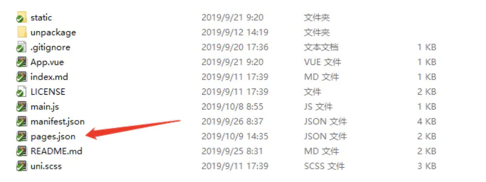
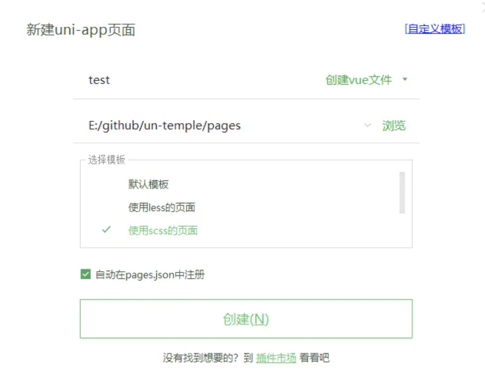
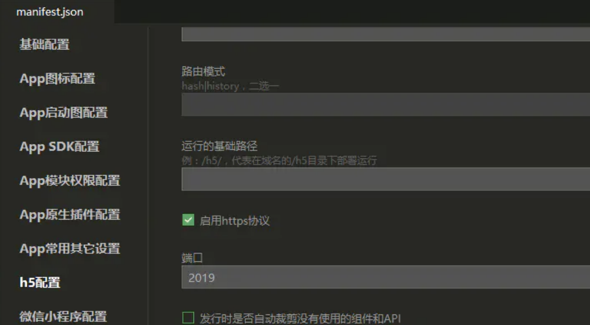
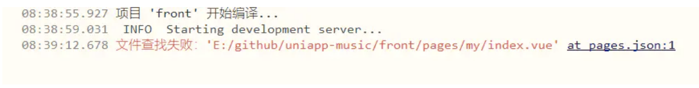
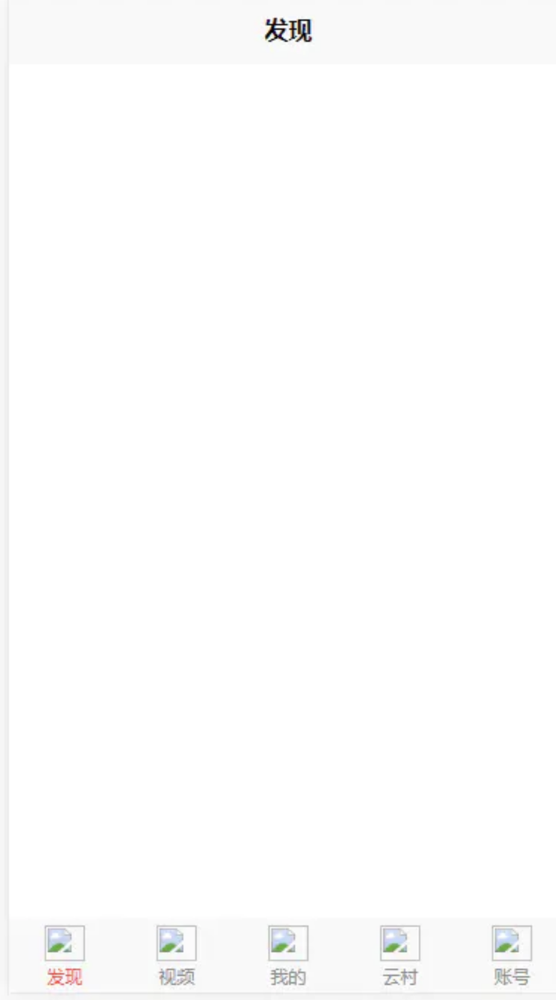

上一节主要讲解了如何架构项目，对文件统一管理等，本节来讲应用中基本功能，路由的配置与导航栏添加。

## 注册添加首页

在设备改变路由的时候，在不同路由会渲染成不同的内容，在 Uniapp 中所有页面的路由全部由框架进行管理，即 pages.json 管理配置。 pages.json 文件中不仅可以管理路由而且可以对 Uniapp 进行全局配置，决定页面文件的路径、窗口样式、原生的导航栏、底部的原生 tabbar 等。

对于 Uniapp 中的每个页面，都需要在页面对应的 pages.json 文件中进行注册，才可以在访问路径中访问到该页面的数据。

可以使用编辑器注册一个页面，鼠标悬浮在左侧项目管理器那一栏，然后鼠标定位在 pages，右击鼠标：

基础页面的代码结构如下：

    <template>
        <view>

        </view>
    </template>

    

    

然后在 pages.json 中 pages 添加一项：

    "pages": [
        {
            "path": "pages/index/index",
            "style": {
                "navigationBarTitleText": "发现",  // 状态栏标题，覆盖掉 globalStyle 中设置的标题
            }
        },

    // ...

`path` 指定的是页面路径，Uniapp 会根据这个路径加载处理 vue 页面，对 vue 文件的 template，script，style 进行编译处理。

注意：

- pages 节点的第一项为应用入口页（即首页）
- 应用中新增/减少页面，都需要对 pages 数组进行修改
- 文件名不需要写后缀，框架会自动寻找路径下的页面资源

`style` 指定的是页面窗口表现，比如每个页面的状态栏、导航条、标题、窗口背景色等，页面中配置项会覆盖 globalStyle 中相同的配置项。开发这个音乐应用并不需要过多的页面特殊处理，保持原有的设置即可。

然后在浏览器即可查看这个页面 http://localhost:8080//pages/index/index，Uniapp 默认端口为 8080，Uniapp 运行的时候会检测本机 8080 端口是否被占用，如果占用就会启用 8081 端口，其次类推。当然你可以自行设置端口，【manifest.json】>>【H5 配置】>>【端口】：

## 配置导航栏

我们需要实现这样一个页面，查看导航栏可以了解到该应用至少需要 5 个页面，需要先注册 5 个页面，根据上面的方式在 pages 文件夹新建注册其他页面:

    ┌─pages
    │  ├─index           // 首页
    │  │  └─index.vue
    │  └─video           // 视频
    │  │  └─index.vue
    │  └─mine            // 我的
    │     └─index.vue
    │  └─cloud           // 云村
    │     └─index.vue
    │  └─account         // 账号
    │     └─index.vue
    ├─static
    ├─main.js
    ├─App.vue
    ├─manifest.json
    └─pages.json

并在 pages.json 设置 `pages`，`tabBar`:

    "pages": [{ //pages数组中第一项表示应用启动页，参考：https://uniapp.dcloud.io/collocation/pages
            "path": "pages/index/index",
            "style": {
                "navigationBarTitleText": "发现"
            }
        }, {
            "path": "pages/video/index",
            "style": {
                "navigationBarTitleText": "视频"
            }
        }, {
            "path": "pages/mine/index",
            "style": {
                "navigationBarTitleText": "我的"
            }
        }, {
            "path": "pages/cloud/index",
            "style": {
                "navigationBarTitleText": "云村"
            }
        }, {
            "path": "pages/account/index",
            "style": {
                "navigationBarTitleText": "账号"
            }
        }
    ],
    "tabBar": {
        "color": "#888",
        "selectedColor": "#ff2419",
        "borderStyle": "white",
        "backgroundColor": "#f9f9f9",
        "list": [{
            "pagePath": "pages/index/index",
            "iconPath": "static/tab/t_1.png",
            "selectedIconPath": "static/tab/t_11.png",
            "text": "发现"
        }, {
            "pagePath": "pages/video/index",
            "iconPath": "static/tab/t_2.png",
            "selectedIconPath": "static/tab/t_21.png",
            "text": "视频"
        }, {
            "pagePath": "pages/mine/index",
            "iconPath": "static/tab/t_3.png",
            "selectedIconPath": "static/tab/t_31.png",
            "text": "我的"
        }, {
            "pagePath": "pages/cloud/index",
            "iconPath": "static/tab/t_4.png",
            "selectedIconPath": "static/tab/t_41.png",
            "text": "云村"
        }, {
            "pagePath": "pages/account/index",
            "iconPath": "static/tab/t_5.png",
            "selectedIconPath": "static/tab/t_51.png",
            "text": "账号"
        }]
    }

代码中的 `tabBar` 的 `list` 对象包含底下导航的 5 个路由页面，初始化的图标风格等，这样就可以实现底部导航栏的设置。

注意：

1.  tabBar 的图标是不支持网络图片，不支持字体图标的，需要放在 static 静态目录里面
2.  路径图标不超过 5 个，代码跳转到 tabbar 页面，api 只能使用 uni.switchTab
3.  导航栏在不同端有不同展示形式，需要处理兼容问题
4.  如果有多端需求，必需真机模拟查看效果，浏览器模拟工具可能没那么准确
5.  pagePath 页面路径，必须在 pages 中先定义

注意: 小程序导航栏只能是以静态图标出现，以及整齐的样式出现，如果需要动态图标或者自定义导航栏（中间凸起），需自行引入自定义组件去更改; Uniapp 是集成了各个框架的特性进行开发设计的(小程序不支持导航动态图标)，如果需要多端保持一致，就要有所取舍，产品设计保持一个平衡点，因此设计之初的时候需要权衡框架的特性。

使用 HBuilderX 编译器的一个好处是，可以随时在编译器正下方的控制台终端看见编译 bug 问题，可以直接定位问题。比如下方出现的报错可以直接知道页面没有注册建立成功还是没有对应好路径：

根据提示做好修改即可，在编译保存（按下 ctrl + S）的时候，界面会同时编译，形成热更新可视化，开发就变得便利快捷。

设置导航栏的背景颜色，图片等，即可实现一个简单的应用。

然后补充一下导航栏图标即可：

然后再进行切图补充页面内容。

## 小结

1.  pages.json 文件用来对 Uniapp 进行全局配置，决定页面文件的路径、窗口样式、原生的导航栏、底部的原生 tabbar 等；
2.  可以使用编译器新增注册页面，简单方便；
3.  随时打开控制台是一个很好的习惯，让你可以快捷的发现问题，根据错误提示直接定位问题；
4.  本章代码 [uni-course-router][]。

[image-20210215153917311]: https://s.poetries.work/images/image-20210215153917311.png
[image-20210215153929153]: https://s.poetries.work/images/image-20210215153929153.png
[image-20210215153944290]: https://s.poetries.work/images/image-20210215153944290.png
[img]: https://s.poetries.work/images/16f368a90d73df90.png
[image-20210215154022419]: https://s.poetries.work/images/image-20210215154022419.png
[image-20210215154035641]: https://s.poetries.work/images/image-20210215154035641.png
[image-20210215154049066]: https://s.poetries.work/images/image-20210215154049066.png
[uni-course-router]: https://github.com/front-end-class/uniapp-music-code/blob/master/uni-course-router.zip
