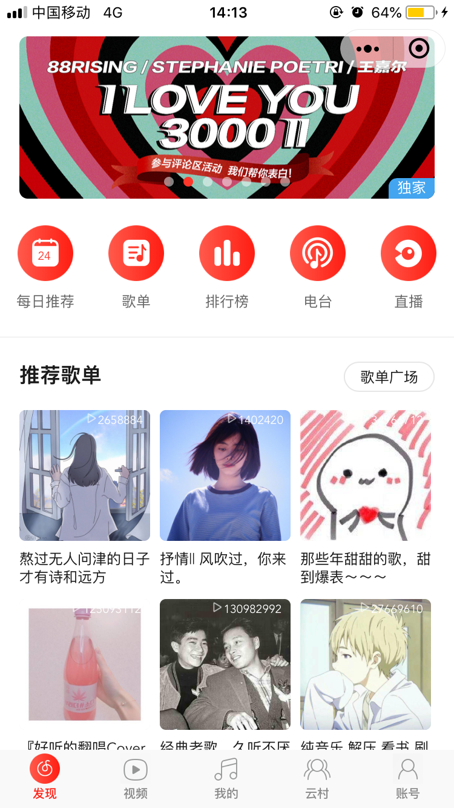
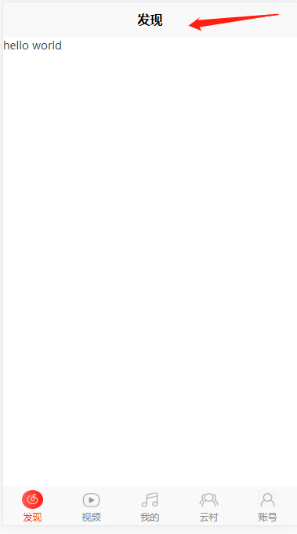
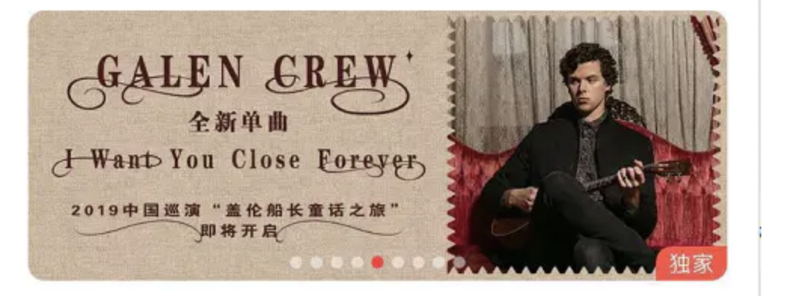
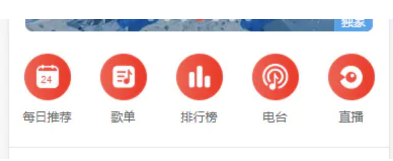
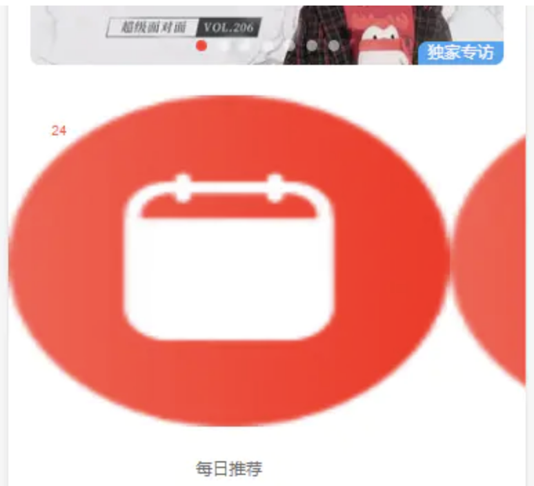
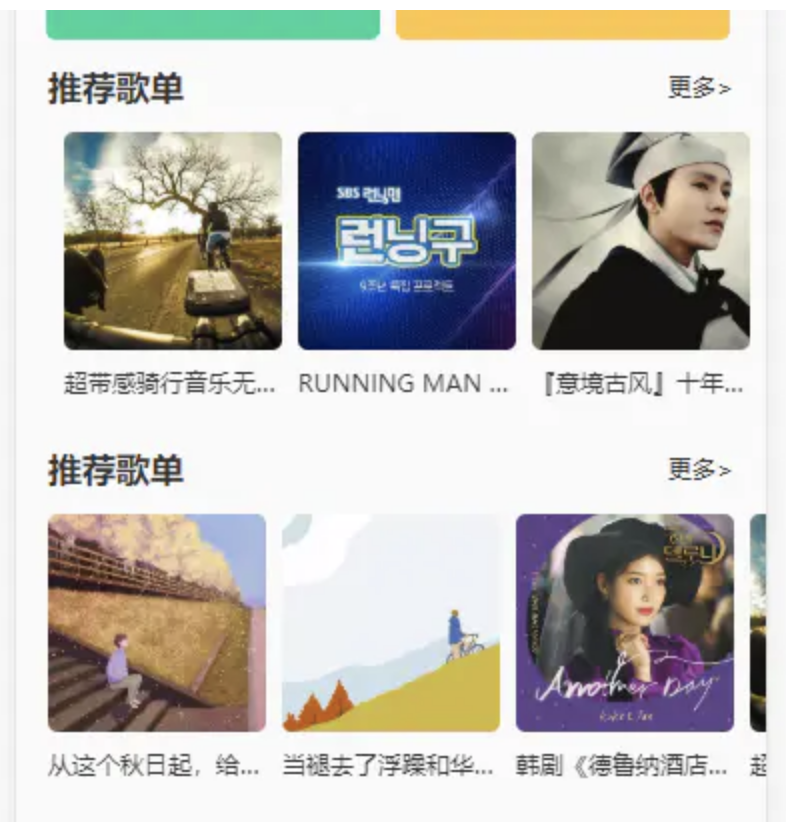
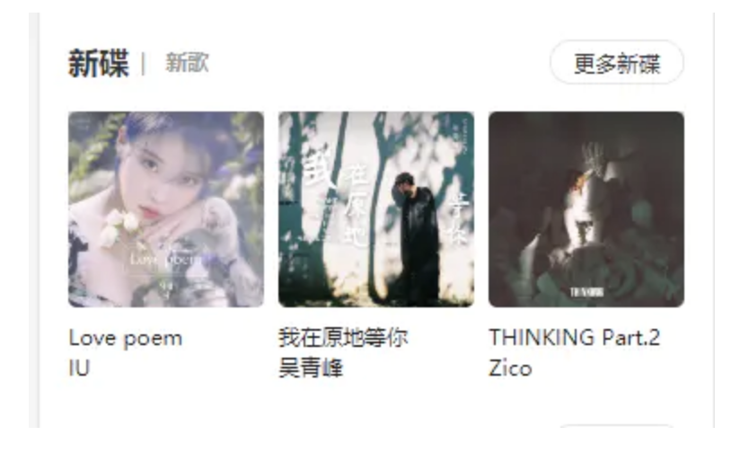
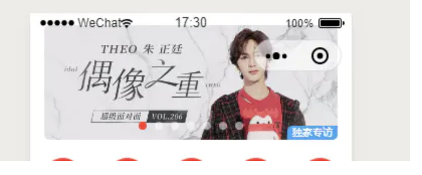

本章正式进入项目页面开发环节，将带大家完整的实现项目中的首页，涵括的功能点包含组件拆分、导航栏引入、banner 轮播、跳转等难点的讲解。

## 去除顶部标题栏

首先看页面布局，页面部分可以分为 2 个小块：轮播图，歌单滑动等小块。

以上图作为 UI 设计稿，我们需要做的是完善页面内容，开发代码以上一节的架构代码为基础，调试以浏览器为优先。

Uniapp 默认情况下在 h5 端的是有 title 标题栏的，如果需要去掉就要在配置文件进行设置，这是未改之前的图片：

当前开发的音乐应用是不需要标题栏的，找到项目的根目录下的 pages.json 文件，添加一下内容，可以去掉对应页面的导航栏，设置 app-plus 的 `titleNView` 为 `false` 即可；

    /* pages.json */

    "pages": [
        {
         "path": "pages/index/index",
            "style": {
                "navigationBarTitleText": "发现",
                "app-plus":{
                    "titleNView": false
                }
            }
        }
    ]

而且作为首页（启动的第一个页面），这个页面需要在 pages 数组中放在第一位，项目在启动的时候就会以此作为第一个启动页。

## 首页 banner 轮播（swiper 组件使用）

这样的 banner 轮播图交互可以选择 swiper 组件来完成，配置[查看][link 1]，代码：

    <swiper class="swiper">
        <swiper-item>
            <view class="swiper-item">包含的内容</view>
        </swiper-item>
    </swiper>

Uniapp 的 swiper 组件为滑块视图容器，可以用于左右滑动或上下滑动，比如 banner 轮播图。注意是滑动切换而不是滚动。swiper 下的每个 swiper-item 是一个滑动切换区域，不能停留在 2 个滑动区域之间。这样的交互效果完美契合了我们要完成的轮播图。

由 swiper 包裹 item 组件，swiper 接受配置参数，完成轮播的特效，我们要实现滑动动画时长 300 毫秒(`duration="300"`)，显示面板指示点（轮播图中间的导航小点）(`indicator-dots="true"`)，自动播放轮播图(`autoplay="true"`)，当前选中的指示点颜色为黑色(`indicator-active-color="#000"`)的设定：

    <swiper class="swiper" indicator-dots="true"  indicator-active-color="#000" autoplay="true" interval="interval" >
        <swiper-item>
            <view class="swiper-item uni-bg-red">A</view>
        </swiper-item>
    </swiper>

我们实现的是需要有圆角的 banner 轮播图，对每个 item 项目设置样式即可。

我们只是书写了样式，怎么让数据对应呢？

## 完成数据请求与数据绑定

跟后台交互的时候，我们需要请求后台数据，Uniapp 有自己封装好的[api][]，通俗易通，跟 jQuery 的 ajax 基本类似，依葫芦画瓢的就行，在 success 前面，是请求完成的回调，比如我会在请求前做一个 loading（菊花）状态呈现在页面，在请求完成后再把 loading 隐藏掉，这个也算是用户体验的一种，让用户预感到一个交互状态在进行中，心里有个预期感，如果网络不好的情况下，这样的作用会显得尤为重要，[文档查看][api]。

    uni.request({
        url: 'http://localhost:3000/personalized',
        method: 'GET',
        header:{},
        data: {},
        success: res => {   // 请求成功的状态
        },
        fail: () => {  // 失败
        },
        complete: () => {   // 接口调用结束的回调函数（调用成功、失败都会执行）
        }
    });

根据上面代码，我们可以引用到首页开发页面中去，并实现一个请求轮播图数据并伴有状态（loading）小动画，来完成轮播图数据的交互，并在页面 `onLoad` 后调用这个方法：

    /* pages/index/index.vue */
    // ...
    data () {
        return {
            swiper: [],
            loading: false
        }
    },
    onLoad() {
        this.getBanner()
    },
    methods: {
        // 获取轮播图
        getBanner() {
            // 正在加载状态
            this.loading = true
            uni.request({
                url: 'http://localhost:3000/banner',
                method: 'GET',
                data: {},
                success: res => {
                    this.swiper = res.data.banners
                },
                complete: () => {
                    // 加载完成状态
                    this.loading = false
                }
            });
        }
    }

    // ...

关于请求的报错，加载 loading 等，都封装在了项目的 request 工具中。因此我们改为 api 的方法来完成请求，在 apis 文件夹中新增 index.js：

    /* apis/index.js */

    import request from '@/utils/request/index.js'

    export function apiGetBanner(data) {
        return request.request({
            url: '/banner',
            method: 'GET',
            data: data,
            authType: 'None'
        })
    }

注意： @ 代表的是开发目录，这是路径别名。

    /* pages/index/index.vue */

    import { apiGetBanner } from '@/apis/index.js';

    // ...
    data () {
        return {
            swiper: [],
        }
    },
    onLoad() {
        this.getBanner()
    },
    methods: {
        // 获取轮播图
        getBanner() {
            apiGetBanner().then(res => {
                this.swiper = res.banners
            })
        },
    }

    // ...

数据可以直接赋值到 model 中的 data 里面，视图 template 直接对应即可：

    <view class="banner">
        <swiper class="swiper" :autoplay="true" :indicator-dots="true" indicator-active-color="#ff372b"
         indicator-color='rgba(255,255,255, .5)' duration="500" :circular="true">
            <swiper-item v-for="(item,index) in swiper" :key="index">
                <view class="item">
                    <image :src="item.imageUrl" class="img"></image>
                    <view class="tag">{{item.typeTitle}}</view>
                </view>
            </swiper-item>
        </swiper>
    </view>

Uniapp 处理了小程序 `this.setData({})` 数据赋值方式，我们可以直接使用 `this.swiper = res.banners` 进行赋值，如果原有的小程序项目需要更改这种赋值方式，或者更改重写 setData 方法：

    setData: function (obj) {
        let that = this;
        let keys = [];
        let val,data;
        Object.keys(obj).forEach(function (key) {
          keys = key.split('.');
          val = obj[key];
          data = that.$data;
          keys.forEach(function (key2, index) {
              if (index+1 == keys.length) {
                  that.$set(data,key2,val);
              } else {
                  if (!data[key2]) {
                     that.$set(data,key2,{});
                  }
              }
              data = data[key2];
          })
        });
    }

更多微信小程序转换 Uniapp 详细指南、小程序转 Uniapp 转换器、wepy 转 Uniapp 需求可以对照，前往[ask.dcloud.net.cn/article/357…][ask.dcloud.net.cn_article_357]

## 主入口的代码实现

这一块的开发看起来相对简单，实际上处理起来可以以更优雅的方式来处理（这一块由于接口的限制也做进一步的说明）。

主入口有五个（包含文字与图标），这些内容都是动态的，不可能把内容直接写死在代码上，在实际业务下需要读取接口。其实前端在实际开发的时候就需要对产品原型有一定了解与前瞻性，哪些是可变的，哪些是不变的，都心里有个底。

在项目准备之初，就已经搭建好整个项目的基本架构（考虑好基本开发），全局样式的引入，通用 js 方法，全局变量等等。这些都是为了更快捷方便的开发整个项目，现在就是使用的时候了。

我把这一块拿出来说，因为大部分开发人员注重 js 逻辑层的书写，往往忽略了基础的 css。往下看，你就会了解到前端 css 显得像利刃一样，开发来的简便快捷一些。像这样等分排列样式，可以用 flex 伸缩盒进行书写构建：

我已经在 common.scss 定义了样式类名 `flex-box`, `flex-item`:

    <!-- common/css/common.scss -->
    .flex-box{
        display:flex;
        .flex-item{
            flex:1;
        }
    }

书写页面代码的时候可以直接对应元素搭建 dom 样式:

    <view class="main-bar flex-box">
        <view class="flex-item" v-for="(item, index) in contentBar" :key="index">
            <image :src="'/static/image/index/t_' + (index + 1) + '.png'" class="img"></image>
            <view>{{item.name}}</view>
            <view v-if="index == 0" class="date">{{curDate}}</view>
        </view>
    </view>
    // data数据
    // ...

    contentBar: [
        { name: "每日推荐" },
        { name: "歌单" },
        { name: "排行榜" },
        { name: "电台" },
        { name: "直播" }
    ],

上面的代码可以基本的实现样式等比排列，你会看到：

你可能心里在骂“弄了半天，怎么还是这样？”

其实你可以看上面的截图，你就会了解，图片并不像我们以前开发的那个样式呈现。原因在于 Uniapp 的框架中，图片 `image`元素是一个组件，在渲染到设备上会自带一个样式（`<image>` 组件默认宽度 300px、高度 225px），这样会撑破你的样式盒子。

在 css 命名上，没有使用复杂的，庸长的，或者难懂的名字。这一块（主入口）代码，可以外层父级元素命名 `main-bar`，里面的图片元素最顶层且颗粒度最小的元素可以命名为 `img`：

    .main-bar {
        padding-bottom:22rpx;
        text-align: center;
        line-height: 70rpx;
        color:#666;
        border-bottom:1rpx solid #e6e6e6;
        .img {
            display: block;
            width: 92rpx;
            height: 92rpx;
            margin: 0 auto;
        }
    }

上面简单的几行就可以实现效果，标题文字的行高和排列由最外层父级决定（`line-height`，`text-align`会继承）。可能你会想起以前自己写的代码：

    <!-- no good -->
    .main-bar {
        margin-top: 38rpx;
        text-align: center;
        line-height: 66rpx;
        .main-bar-img {
            display: block;
            width: 124rpx;
            height: 60rpx;
            margin: 0 auto;
            line-height: 1;
        }
        .main-bar-name{
            text-align: center;
            line-height: 66rpx;
        }
    }

上面的代码在命名上是重复性的，以及不必要的，样式也是。在命名上最外层块的父级其实已经包含了基本的样式，也定义了属于那一块，里面的子元素就不用再去重复叠加命名了。在其他代码块也一样设定，如果想了解更多命名规范可以在网上查找 BEM，这些会让你感觉到 css 也是一把利刃。😃

    <view v-if="index === 0" class="date">{{curDate}}</view>

上面的这句是每日推荐对应的日期，`v-if="index === 0"` 列表索引的第一个 item 才生效。

## 使用自定义组件完成歌单

在代码书写中，大家都会把共用的方法抽出来，共用的变量抽出来进行变量共享。

记得我在前面说过，在软件开发里，有些通用的思想，比如隔离变化，约定优于配置等，隔离变化就是说做好抽象，把一些容易变化的地方找到共性，隔离出来，不要去影响其他的代码。这在开发里面以功能细分称为模块，以组成细分称为组件。一台电脑由主机，显示器，键盘，鼠标组成，细分为几个模块；单个鼠标由滚轮，外壳，内芯组成。

根据上面的思想，那么推荐歌单，达人歌单，最新专辑三个模块的共有的有主标题，链接更多，歌单数据（图片，内容文字等），那么我们就可以把想要的组件基本的抽离。

分析组件：

1.  建立组件的模板，先把架子搭起来，命名约定，组件样式，考虑好组件的基本逻辑。
2.  组件的数据输入，即定好 props 里面的数据类型。
3.  组件的数据输出，即对外暴露出来的方法和数据。

在 components 文件夹创建 songList.vue 文件:

    <template>
        <view class="song-list-comp">
            <view class="tit-bar">
                {{title}}
                <navigator :url="link" class="more fr">歌单广场</navigator>
            </view>
            <view class="clearfix">
                <view class="item" v-for="(item, index) in list" :key="index">
                    <image class="img" :src="item.picUrl + $imgSuffix"></image>
                    <view class="desc">{{item.name}}</view>
                    <view class="count"> {{ item.playCount}}</view>
                </view>
            </view>
        </view>
    </template>

    
    

这样我们在首页 /pages/index/index.vue 就可以引用这个组件了

    <!-- /pages/index/index.vue -->
    <template>
        <view>
            <songList title="推荐歌单" link="test?id=123" :list="recommendSongs"/>
        </view>
    </template>
    

你会看到推荐歌单会渲染两个，一个是由组件渲染，另一个则是页面代码渲染。上面只是一个示例与组件实现思想，其实接口字段不完全相同的，如果需要完全共用，就需要重新修改数据字段，这样就可以完全的使用通用组件了。

## 实现 tab 切换加载不同数据

点击 tab 切换加载不同数据，并且选中的 tab 样式进行突出设置，未选中保持平常样式。

    <!-- 歌单分类块 -->
    <view class="song-list">
        <view class="switch-line flex-box">
            <view class="flex-box">
                <view class="switch-item" :class="{on : newType == 1}" @click="switchTab(1)">新碟</view>|
                <view class="switch-item" :class="{on : newType == 2}" @click="switchTab(2)">新歌</view>
            </view>
            <template v-if="newType == 1">
                <view class="more">更多新碟</view>
            </template>
            <template v-if="newType == 2">
                <view class="more">新歌推荐</view>
            </template>
        </view>
        <scroll-view class="scroll-view" scroll-x>
            <view class="item" v-for="(item, index) in latestAlbum" :key="index">
                <image class="img" :src="item.picUrl + $imgSuffix"></image>
                <view class="desc ellipsis">{{item.name}}</view>
                <view class="desc ellipsis c9">{{item.artist.name}}</view>
            </view>
        </scroll-view>
    </view>
    // 切换新碟新歌
    switchTab (type) {
        this.newType = type
        // 根据类型加载不同数据
        if (type == 1) {
            // 新碟数据
        }
        if (type == 2) {
            // 新歌数据
        }
    },

在元素 `@click="switchTab(1)"` 事件的点击触发，传值 1 ，修改了 `newType` 的值为 1，传给 :class 一个对象，以动态地切换 class：

    <view class="switch-item" :class="{on : newType == 1}">新碟</view>

上面的语法表示 on 这个 class 存在与否将取决于数据属性 newType 是否等于 1。如果等于 1，class 的值将会添加 on，结果渲染为：

    <view class="switch-item on">新碟</view>

这样实现互斥样式的改变，取决于点击改变 newType 的值。切换不同数据也是一样的原理。

## 其他处理

当前页开发设计中去掉了导航栏，当页面配置 navigationStyle 设置为 custom 的时候可以使用此组件替代原生导航栏，在 pages.json:

    "globalStyle": {
        "navigationBarTextStyle": "black",
        "navigationBarTitleText": "Uniapp Music",
        "navigationBarBackgroundColor": "#F8F8F8",
        "backgroundColor": "#F8F8F8",
        "navigationStyle": "custom"
    }

当前首页在小程序端显示下并没有导航栏，页面内容直接从设备顶部屏幕暂时，会出现运营商展示栏遮盖页面内容的问题，我们需要对小程序端差异化处理。对小程序添加一个顶部间隔：

// 平台差异化处理的代码可以放在底部，这样有利于集中管理

    /* #ifdef MP-WEIXIN */
    .banner{
        margin-top:60rpx;
    }
    /* #endif */

小结：

1.  导航栏和标题栏都可以在 pages.json 设置，掌握多端的特性，可以做出多样化的应用；
2.  尽量使用框架的组件，可以提高开发效率，可以在 [插件市场][link 2] 查找想要的功能；
3.  良好的命名习惯能让你的开发质量提升一个档次；
4.  不同端差异化集中处理，不仅有利于管理，还可以一目了然。
5.  本章代码 [uni-course-实战开发发现页][uni-course-]。

[img]: https://s.poetries.work/images/16f3690afa3ee12a.png
[img 1]: https://s.poetries.work/images/16f369b535843041.png
[image-20210215154223903]: https://s.poetries.work/images/image-20210215154223903.png
[link 1]: https://uniapp.dcloud.io/component/swiper
[api]: https://uniapp.dcloud.io/api/request/request
[ask.dcloud.net.cn_article_357]: https://ask.dcloud.net.cn/article/35786
[image-20210215154241419]: https://s.poetries.work/images/image-20210215154241419.png
[image-20210215154257832]: https://s.poetries.work/images/image-20210215154257832.png
[image-20210215154319990]: https://s.poetries.work/images/image-20210215154319990.png
[image-20210215154333718]: https://s.poetries.work/images/image-20210215154333718.png
[image-20210215154349904]: https://s.poetries.work/images/image-20210215154349904.png
[link 2]: https://ext.dcloud.net.cn/
[uni-course-]: https://github.com/front-end-class/uniapp-music-code/blob/master/uni-course-%E5%AE%9E%E6%88%98%E5%BC%80%E5%8F%91%E5%8F%91%E7%8E%B0%E9%A1%B5.zip
