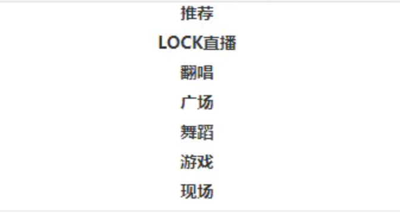

本节主要讲解 scroll-view 在页面上的使用，长列表的渲染。

## scroll-view 滑动效果实现头部导航栏

导航的滑动区域需要实现左右滑动效果，左右滑动这个在信息资讯设计下很常见，可以选用 Uniapp 中基础组件 `scroll-view` 容器，在遇到与左右或者上下互动局部内容的时候，可以考虑组件 `scroll-view`，配置查看[scroll-view][]，示例代码：

    <scroll-view class="scroll-view" scroll-x="true" scroll-left="120">
        <view class="item uni-bg-red">A</view>
        <view class="item uni-bg-green">B</view>
        <view class="item uni-bg-blue">C</view>
    </scroll-view>

在方位 x 轴上进行参数设置，即设置 `scroll-x="true"`，即可实现，左右滑动，一切就是那么简单...

但是当你以为一切就这样搞定的时候，可是并没有左右排列，肿么办？

其实是关于 scroll-view 失效的问题，复制官方代码代码后会发现 scroll-view 横向滚共不生效，其实是没有设置好样式，将 scroll-view 容器设置宽度，并设置 white-space: nowrap; scroll-view 容器的每一项都设置宽度和 `display:inline-block`：

    .scroll-view {
        width: 100%;
        white-space: nowrap;
        .item {
            position: relative;
            display: inline-block;
            width: 218rpx;
            padding-bottom:16rpx;
            margin-right: 16rpx;
            line-height: 34rpx;
        }
    }

## 通过绑定 class/style 实现 active 滑块

这块的交互是点击触发实现滑块滑动至被触发的项，以及被触发的项实现样式切换。

    <scroll-view class="scroll-view" scroll-x>
        <view class="item" v-for="(item, index) in navList" :class="{active: curNav == item.id}" :key="item.id" @click="switchNav(item.id, index)">
            <view class="desc">{{item.name}}</view>
        </view>
        <view class="slide" :style="'width: '+ sliderWidth +'rpx;transform: translateX('+ sliderOffset +'rpx)'"></view>
    </scroll-view>
    // 导航切换
    switchNav(id, index) {
        this.curNav = id
        this.sliderWidth = index == 1 ? 140 : 60;

        this.sliderOffset = 126 * index + (index > 1 ? 80 : 16) + (index == 0 && 16);
        // 加载数据
        this.getRelatedVideo(id)
    }
    .scroll-view {
        position: fixed;
        top: 0;
        width: 100%;
        white-space: nowrap;
        text-align: center;
        line-height: 86rpx;
        color: #333;
        .item {
            position: relative;
            display: inline-block;
            min-width: 126rpx;
            padding: 0 20rpx;
            line-height: 34rpx;
            padding-bottom: 16rpx;
            <!-- 触发项样式 -->
            &.active{
                color:#f32628;
            }
        }
    }
    <!-- 滑块样式 -->
    .slide {
        position: absolute;
        width: 60rpx;
        height: 4rpx;
        left: 0;
        bottom: 0rpx;
        background: #f32628;
        transition: transform 0.3s;
    }

触发项的样式由 `:class="{active: curNav == item.id}"` 判定，active 这个 class 存在与否将取决于数据属性 curNav 是否等于为当前触发项的 id。class 的值将会添加 on，结果渲染为：

    <view class="item active"></view>

对应上类名 active 的样式即可实现触发项样式的切换。

底部滑块的动画需设置 `transition: transform 0.3s;` 样式，只要改变 transform 属性值 translateX 即可实现左右动画。关键在于样式的绑定改变：

    <view class="slide" :style="'width: '+ sliderWidth +'rpx;transform: translateX('+ sliderOffset +'rpx)'"></view>
    // 导航切换
    switchNav(id, index) {
        this.curNav = id
        this.sliderWidth = index == 1 ? 140 : 60;

        this.sliderOffset = 126 * index + (index > 1 ? 80 : 16) + (index == 0 && 16);
        //
        this.getRelatedVideo(id)
    }

点击导航判定触发项的索引，计算出滑块偏移位置 translateX 的值即可。与 `:class="{active: curNav == item.id}"` 不同的是，`:style` 由拼接字符决定整个值。

## 长列表 list 的渲染

长列表的数据直接是请求后台列表数据，再用 v-for 循环遍历渲染到页面上：

    <view class="video-list">
        <view class="video-item" v-for="item in relatedVideo">
            <view class="video-wrap">
                <image class="img" :src="item.coverUrl + $imgSuffix"></image>
                <view class="desc ellipsis">{{item.title}}</view>
                <view class="creater-bar flex-box">
                    <view class="avactor-box flex-box">
                        <image class="avactor" src=""></image>
                        <view class="name">{{item.creator[0].userName}}</view>
                    </view>
                    <view class="more">
                        <view class="iconfont"></view>
                    </view>
                </view>
            </view>
        </view>
    </view>
    import { apiGetRelatedVideo } from '@/apis/index.js';
    export default {
        data() {
            return {
                relatedVideo: [],
            };
        },
        methods: {
            // 获取相关视频
            getRelatedVideo(id) {
                this.curNav = id
                const params = {
                    id
                }
                apiGetRelatedVideo(params).then(res => {
                    this.relatedVideo = res.data
                })
            },
        }
    }

列表项有个更多的三点图标（上图箭头所指）是由 iconfont 渲染而成，只要在 iconfont 项目库中加入这个图标并在 Uniapp 项目引入直接可以使用：

    <view class="iconfont"></view>

提示：关于 Uniapp 项目如何引入 iconfont 的操作，可查看基础课程《使用 iconfont 作为整站图标》章节。

## 列表处理下拉更新，上拉加载

移动端长列表浏览是一个非常常见的浏览交互，用户可以下拉刷新当前第一页的数据，也可以滑动到底部（上拉）无限加载数据。在 Uniapp 项目中一般使用 `scroll-view` 可滚动视图区域组件实现多端下的浏览。`scroll-view` 可以轻松解决滚动到顶部/底部的事件处理。

但是用 `scroll-view` 处理长列表很容易引发性能问题，不仅要判断偏移位置，而且要响应交互回调，我们在处理复杂多变的功能时，可以在官方[插件市场][link 1]寻找适合功能的插件，通过示例改成适用自己项目的功能。关于[下拉刷新上拉加载组件][link 2]，我这选用了一个插件 [mescroll][]，比较合适当前有导航栏和长列表组成的页面。

相关代码：

    <!-- top="86" 向下偏移导航栏的高度 -->
    <mescroll-uni top="86" :down="downOption" :up="upOption" @down="downCallback" @up="upCallback">
        <view class="video-list">
            <view class="video-item" v-for="(item, index) in relatedVideo" :key="index">
                <view class="video-wrap">
                    <image class="img" :src="item.coverUrl + $imgSuffix"></image>
                    <view class="desc ellipsis">{{item.title}}</view>
                    <view class="creater-bar flex-box">
                        <view class="avactor-box flex-box">
                            <image class="avactor" src=""></image>
                            <view class="name">{{item.creator[0].userName}}</view>
                        </view>
                    </view>
                </view>
            </view>
        </view>
    </mescroll-uni>
    // ...
    data() {
        return {
            // 下拉刷新的常用配置
            downOption: {
                auto: false // 是否在初始化后,自动执行下拉回调callback; 默认true
            },
            // 上拉加载的常用配置
            upOption: {
                auto: false, // 是否在初始化完毕之后自动执行上拉加载的回调; 默认true
                page: {
                    num: 0, // 当前页码,默认0,回调之前会加1,即callback(page)会从1开始
                    size: 10 // 每页数据的数量,默认10
                },
            },
        }
    },
    methods: {
        // ...
        /*下拉刷新的回调 */
        downCallback(mescroll) {
            mescroll.resetUpScroll(); // 重置列表为第一页 (自动执行 page.num=1, 再触发upCallback方法 )
        },
        /*上拉加载的回调: mescroll携带page的参数, 其中num:当前页 从1开始, size:每页数据条数,默认10 */
        upCallback(mescroll) {
            //联网加载数据
            this.getList(mescroll.num, mescroll.size, (res) => {
                //设置列表数据
                if(mescroll.num == 1) this.relatedVideo = []; //如果是第一页需手动置空列表
                this.relatedVideo = this.relatedVideo.concat(res)
                // 后台接口有返回列表的总数据量 totalSize
                // mescroll.endBySize(10, 50); //必传参数(当前页的数据个数, totalSize总数据量)
                mescroll.endSuccess();
            }, () => {
                //联网失败的回调,隐藏下拉刷新的状态
                mescroll.endErr();
            })
        }
    }

可以看到下图中下拉状态的交互样式。

在引用这个插件前，由于多端的差异化太大，需要对 pages.json 进行配置，只配置使用 mescroll-uni 的页面，可以解决取消 ios 回弹，避免和下拉刷新冲突等问题。

    "path": "pages/video/index",
    "style": {
        "navigationBarTitleText": "视频",
        "app-plus":{
            "titleNView": false,
            "bounce" : "none", // 取消 ios 回弹，避免和下拉刷新冲突
            "disableScroll": true   // Android小程序卡顿
        }
    }

页面初始化时，如果一次性向视图层传递大量的数据，使视图层一次性渲染大量节点，可能造成通讯变慢、页面切换卡顿，所以建议以局部更新页面的方式渲染页面。如：服务端分页；服务端返回 100 条数据，进行分批加载，一次加载 50 条，500ms 后进行下一次加载。

其实 scroll-view 不适合放长列表，有性能问题。长列表滚动和下拉刷新，应该使用原生导航栏搭配页面级的滚动和下拉刷新实现。包括在 app-nvue 页面，长列表应该使用 list 而不是 scroll-view。当前为了页面效果，权衡舍弃了页面级的滚动。

如果是在 app-nvue 下处理长列表，使用 list 组件的性能高于使用 view 或 scroll-view 的滚动。原因在于 list 在不可见部分的渲染资源回收有特殊的优化处理。`<list>` 组件是提供垂直列表功能的核心组件，拥有平滑的滚动和高效的内存管理，非常适合用于长列表的展示。**注意当前是 vue 项目，不是 app-nvue 项目**，因此未使用 list 完成长列表功能。

## 小结

1.  scroll-view 的左右滑动需要样式设置，关键在于 `white-space: nowrap`；
2.  点击切换的常用功能通常操作元素的 class，传给 `:class` 一个对象，以动态地切换 class 值；
3.  scroll-view 可以处理列表的下拉更新，上拉加载功能，可以找现成的功能插件完成开发。
4.  本章代码 [uni-course-实战开发视频页][uni-course-]。

[image-20210215154450634]: https://s.poetries.work/images/image-20210215154450634.png
[scroll-view]: https://uniapp.dcloud.io/component/scroll-view
[image-20210215154502950]: https://s.poetries.work/images/image-20210215154502950.png
[image-20210215154517129]: https://s.poetries.work/images/image-20210215154517129.png
[img]: https://s.poetries.work/images/16f3743ed6f051a0.png
[link 1]: https://ext.dcloud.net.cn/
[link 2]: https://ext.dcloud.net.cn/plugin?id=343
[mescroll]: https://github.com/mescroll/mescroll
[uni-course-]: https://github.com/front-end-class/uniapp-music-code/blob/master/uni-course-%E5%AE%9E%E6%88%98%E5%BC%80%E5%8F%91%E8%A7%86%E9%A2%91%E9%A1%B5.zip
