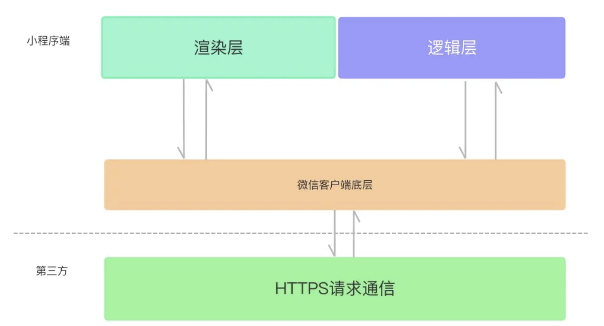
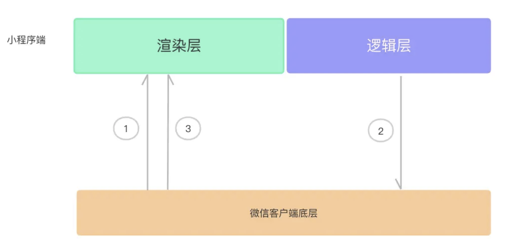
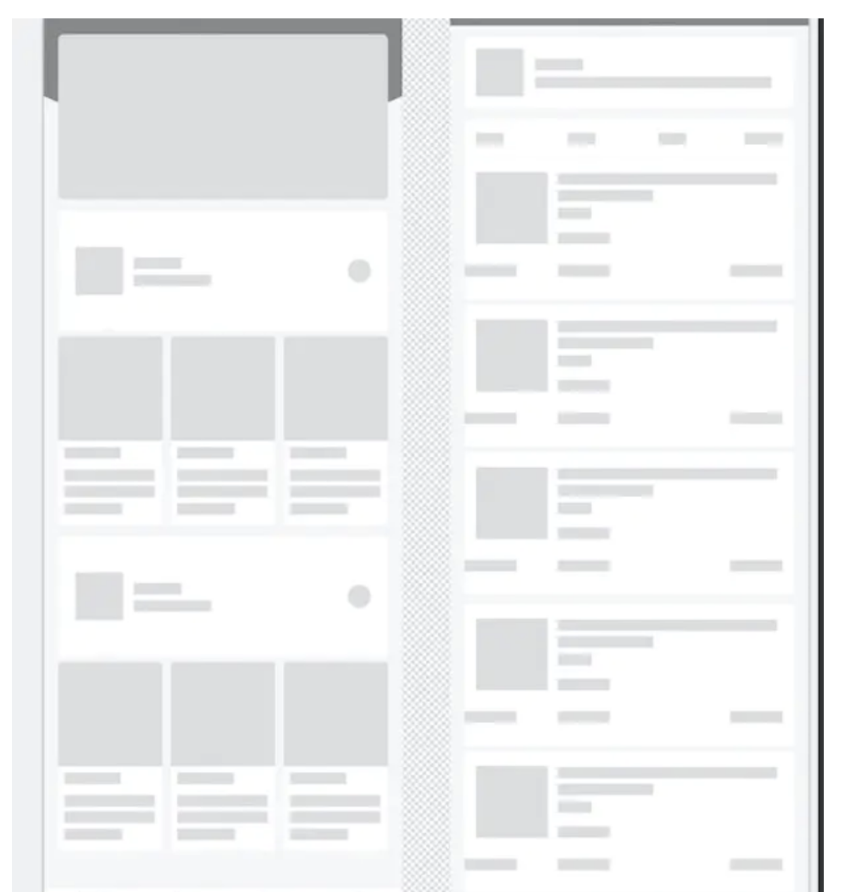

这章谈谈在开发中的一些常用优化方案

## setData

先科普下小程序架构，来源于官方介绍：

#### 双线程设计

- 逻辑层：创建一个单独的线程去执行 JavaScript，在这个环境下执行的都是有关小程序业务逻辑的代码
- 渲染层：界面渲染相关的任务全都在 WebView 线程里执行，通过逻辑层代码去控制渲染哪些界面。一个小程序存在多个界面，所以渲染层存在多个 WebView 线程

#### 双线程通信

前面我们知道，逻辑层和渲染层的通信会由 Native （微信客户端）做中转，逻辑层发送网络请求也经由 Native 转发。

- 1.在渲染层把 WXML 转化成对应的 JS 对象。
- 2.在逻辑层发生数据变更的时候，通过宿主环境提供的 setData 方法把数据从逻辑层传递到 Native，再转发到渲染层。
- 3.经过对比前后差异，把差异应用在原来的 DOM 树上，更新界面。

再科普下 setData 做的事情：

> 在数据传输时，逻辑层会执行一次 JSON.stringify 来去除掉 setData 数据中不可传输的部分，之后将数据发送给视图层。同时，逻辑层还会将 setData 所设置的数据字段与 data 合并，使开发者可以用 this.data 读取到变更后的数据。

我们知道，用户的一次交互，如点击某个按钮，开发者的逻辑层要处理一些事情，然后再通过 setData 引起界面变化。这样的一个过程需要四次通信：

- 渲染层 -> Native（点击事件）
- Native -> 逻辑层（点击事件）
- 逻辑层 -> Native（setData）
- Native -> 渲染层（setData）

因此频繁调用，视图会一直更新，阻塞用户交互，这样的操作流程会导致用户体验卡顿，引发性能问题。

知道原理后，我们可以采取以下方法：

- 首次加载 —— 读取接口的时候，尽量不要做 setData 操作
- 合并更新 —— 避免频繁的去 setData
- 局部更新 —— 减少数据传递时间和渲染效率
- wxs —— 在一定程度上缓解了微信小程序架构中跨线程通信的开销，具体可以查看官方文档 [wxs][]

## 尽可能多用原生组件

因为小程序是 Hybrid 应用，除了 Web 组件的渲染体系，还有原生组件的渲染。

它有几个好处：

- 绕过 setData、数据通信和重渲染流程，使渲染性能更好。
- 扩展 Web 的能力。比如像输入框组件（input, textarea）有更好地控制键盘的能力。
- 体验更好，同时也减轻 WebView 的渲染工作。比如像地图组件这类较复杂的组件，其渲染工作不占用 WebView 线程，而交给更高效的客户端原生处理。

它也有坏处：

- 原生组件的层级会比所有在 WebView 层渲染的组件要高
- 样式无法应用到原生组件上

## 分屏渲染，延迟加载

- 首屏模块和非首屏模块。简单说就是首页接口合理拆分，先加载首屏模块，再夹在非首屏模块，以此确保首屏内容以最快速度呈现。一次大量的 setData 会导致页面的卡住。
- 弹窗、右侧浮窗可以等主页面渲染完成再延迟 1-2 秒加载数据。
- 如果首页比较长，位于 3 屏之后的数据，有部分用户不一定会查看到的，可以延迟加载也可以选择滚动到距离底部“100px”再加载（例如首页“精选视频”模块），适当减少请求。

## 骨架屏

Skeleton Screen，相比于 loading 菊花图效果，骨架屏只是从感官上提升了用户体验，对性能没太多帮助（可能会消耗更多），相对于菊花图技术上会稍微复杂，请自行取舍。

## 动画效果

由于架构的原因，频繁执行耗时逻辑改变视图，会造成动画掉帧。尽量用 css3 的动效，比如 fade-in-right/fade-out-right。

## 分包策略

小程序可以分主包和分包，主包是入口的文件包，其余可以归为分包。

当用户第一次打开小程序，会先下载好所有代码，然后再加载页面；当用户再次进入时，会直接使用已下载的代码，省去了代码下载的过程，打开速度更快。

微信小程序每个分包的大小是 2M，总体积一共不能超过 8M。 支付宝小程序每个分包的大小是 2M，总体积一共不能超过 4M。

我们公司最近开发的一款小程序，

- 在使用分包之前，压缩后的代码量大概是 2.23M，每个新用户第一次都需要下载的全部代码才能进入页面，差不多花费 3 秒时间才进入小程序。
- 使用分包机制后，主包大小控制在 1M 左右，平均 1 秒左右就可以进入小程序，下载时间大约降低了 60%。

文件结构：

├── apis ├── components ├────... ├── pages 主包根目录 ├────index 首页 ├────my 我的 ├────... ├── subPages 分包根目录 ├────search 搜索页分包 ├────shopcart 购物车页分包 ├────...

## 本地图片压缩

- 推荐一个网站[tinypng][]，非常好用，它采取更严格的压缩算法在不失真情况下做到最优的输出。
- 转成 base64。
- 小程序的 `image` 组件可以支持 JPG、PNG、SVG、WEBP、GIF 等格式。尽可能利用 WEBP 格式优势，对比无损压缩体积比 PNG 小 26%，有损压缩体积比 JPEG 小 25-34%。
- 利用 `image` 组件自带 `lazy-load` 懒加载属性（但是有要求：在即将进入一定范围（上下三屏）时才开始加载）。

## 压缩代码，清理无用的代码

- 小程序打包是会将工程下所有文件都打入代码包内，从而影响到整体代码包的大小。
- 通过配置 project.config.json 文件的 packOptions 属性的 ignore ，可以排除不必要打包的文件，例如：因为本地集成组件库的文档，开发时需要查看，但是打包上传就应该忽略。

## 图片放 cdn

- 这个不赘述，主要利用 cdn 优势。

## 图片延迟加载

- 所谓的懒加载策略，用户没有滚动到可视区域内的图片不必渲染，好处是避免资源浪费和减少渲染消耗。通过监听 onPageScroll 方法来操作，不过要注意 scroll 的消耗。
- 也有利用 intersectionObserver 这个 api，具体用法可以自行百度。

## 接口合并

- 属于 HTTP 优化策略，一个请求经过三次握手四次挥手，所以尽可能通过后端合并接口，做到减少接口请求次数。

## 缓存数据

- 不常变的数据，可以采取缓存策略，例如，省市区的这类元数据。
- 缓存接口数据，放入 Vuex 或 globalData，减少重复请求。

## 防抖节流

这两个含义多数童鞋反馈搞不清，我来通俗点描述：

#### 防抖 debounce

- 当重复执行某个方法时，只有最后的那次方法，在到达设定的间隔时间才会执行。
- 多用于 input 的输入时，显示匹配的输入内容的情况。

#### 节流 throttle

- 设定的单位时间内，第一次触发函数并执行，之后 n 秒内不管触发多少次，都不执行。直到下一个单位时间 n 秒，第一次触发函数并执行，可以理解为间隔执行。
- 多用于页面 scroll 滚动，或者窗口 resize，或者防止按钮重复点击等情况

最标准的当属 `lodash` 库的两个方法，[debounce][]，[throttle][]，有兴趣的可以查看源码。

## 内存告警

当 iOS/Android 向小程序进程发出内存警告时，会触发 `wx.onMemoryWarning()` 事件。我们可以利用这个 API 来收集机型终端，版本号，页面路径等信息，上传至监控平台（例如：Sentry）来做针对性地做优化。

## 长列表

小程序官方提供了一个 [长列表组件 recycle-view][recycle-view]，和 Vue 的长列表 [vue-virtual-scroll-list][] 思路相似，基本实现就是监听 scroll 事件，并且重新计算需要渲染的数据，不需要渲染的数据留一个空的 div 占位元素。

## lazyCodeLoading

通常情况下，在小程序启动期间，所有页面及自定义组件的代码都会进行注入，当前页面没有使用到的自定义组件和页面在注入后其实并没有被使用。

自基础库版本`2.11.1`起，微信小程序支持有选择地注入必要的代码，以降低小程序的启动时间和运行时内存。

    {
      "lazyCodeLoading": "requiredComponents"
    }

当配置了这一项时，微信小程序仅注入当前页面需要的自定义组件和页面代码，在页面中必然不会用到的自定义组件不会被加载和初始化。添加这项配置后，未使用到的代码文件将不被执行。

## 小结

本章主要通过了解小程序架构，介绍小程序开发的一些优化手段，不仅仅限定于这些，技术在发展，我们也需要不断踩坑填坑中向前走。

[image-20210215153202861]: https://s.poetries.work/images/image-20210215153202861.png
[image-20210215153218219]: https://s.poetries.work/images/image-20210215153218219.png
[wxs]: https://developers.weixin.qq.com/miniprogram/dev/framework/view/wxs/
[image-20210215153354442]: https://s.poetries.work/images/image-20210215153354442.png
[tinypng]: https://tinypng.com/
[debounce]: https://www.lodashjs.com/docs/latest#debounce
[throttle]: https://www.lodashjs.com/docs/latest#throttle
[recycle-view]: https://developers.weixin.qq.com/miniprogram/dev/extended/functional/recycle-view.html
[vue-virtual-scroll-list]: https://github.com/tangbc/vue-virtual-scroll-list
