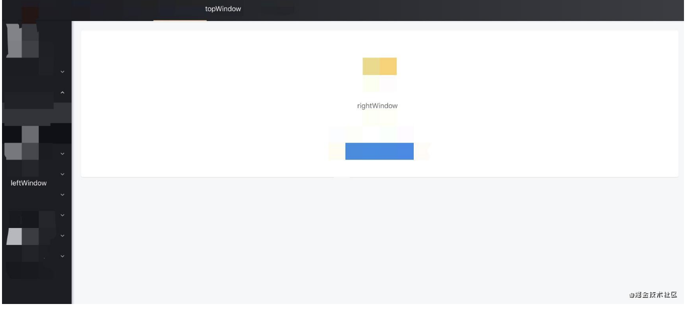
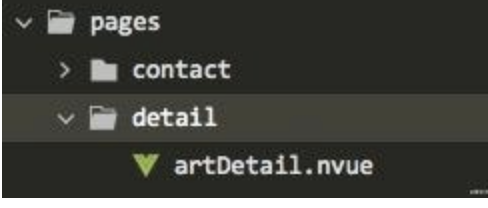
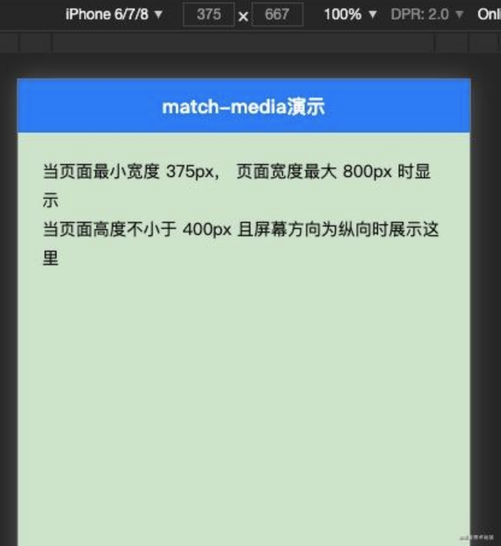
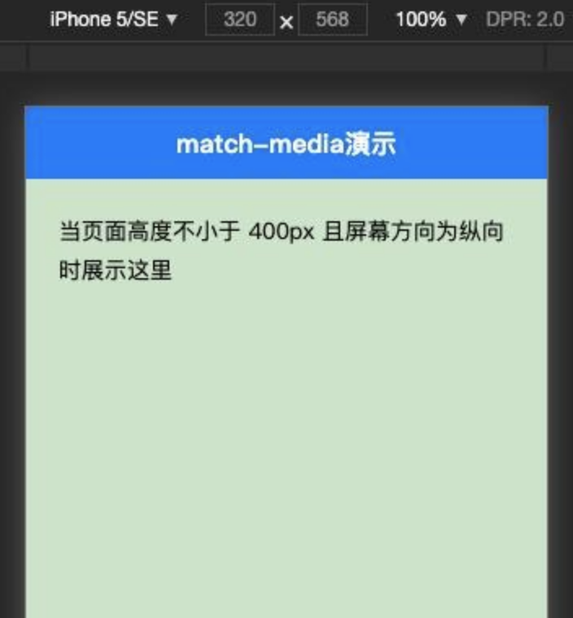

---

## sidebarDepth: 3

最近（20201014）`Uniapp`官方在`HBuilderX 2.9.3`版本更新中，增加了 PC 宽屏适配的功能，在写下本章时该功能只支持`H5`端，这章来尝尝鲜。

[官方文档][link 1]介绍得很详细，这章我打算以我的看法来介绍。

目前适配主要大致分为两种：

1.  框架级适配 -- 在 `page.json` 增加配置项，可选有`leftWindow`、`rightWindow`、`topWindow`
2.  组件级适配 -- 使用`match-media`组件

## 框架级适配

`leftWindow`、`rightWindow`、`topWindow`，顾名思义就知道代表`左右上`的位置，从用户体验和产品角度，这种模式对使用范围还是有所约束，适合上导航，左分类，右内容的布局，对，我说的就是`后台管理系统`。

首先，在`page.json`里加入配置：

    {
      "globalStyle": {

      },
      "topWindow": {
        "path": "responsive/top-window.vue", // 指定 topWindow 页面文件
        "style": {
          "height": 60
        },
        "matchMedia": {
          "minWidth": 0
        }
      },
      "leftWindow": {
        "path": "responsive/left-window.vue", // 指定 leftWindow 页面文件
        "style": {
          "width": 300
        }
      },
      "rightWindow": {
        "path": "responsive/right-window.vue", // 指定 rightWindow 页面文件
        "style": {
          "width": "calc(100vw - 400px)" // 页面宽度
        },
        "matchMedia": {
          "minWidth": 768 //生效条件，当窗口宽度大于768px时显示
        }
      }
    }

然后建立目录和文件`responsive/right-window.vue`，加入用于显示右内容的代码：

    <!--responsive/right-window.vue-->
    <template>
      <view>
        <pages-detail-artDetail ref="detailPage"></pages-detail-artDetail>
      </view>
    </template>

`responsive/top-window.vue`，加入用于显示上导航的代码：

    <!--responsive/top-window.vue-->
    <template>
      <view>
        <view class="logo">logo</view>
        <pages-head-nav ref="navPage"></pages-head-nav>
      </view>
    </template>

这里要说明一下，`<pages-detail-artDetail>`组件是**按照目录结构**来命名的，他表示的是`pages -> detail -> artDetail文件`，

组件数据渲染通过`uni.$emit`和`uni.$on`通信获取：

    <!--父-->
    uni.$emit('updateDetail', {
      detail: encodeURIComponent(JSON.stringify(detail))
    })
    <!--子-->
    uni.$on('updateDetail', (e) => {
      this.$refs.detailPage.load(e.detail);
    })

## 组件级适配

`match-media`组件是媒体查询适配组件，用于动态屏幕适配，可以在页面多次使用。

在`match-media`组件中放置内容，并为组件指定一组`media query`媒体查询规则，如屏幕宽度。运行时，如屏幕宽度满足查询条件，这个组件就会被展示，反之则隐藏。

    <template>
        <view>
            <match-media :min-width="375" :max-width="800">
              <view>当页面最小宽度 375px， 页面宽度最大 800px 时显示</view>
            </match-media>

            <match-media :min-height="400" :orientation="landscape">
              <view>当页面高度不小于 400px 且屏幕方向为纵向时展示这里</view>
            </match-media>
        </view>
    </template>

页面小于 375px，第一段代码被隐藏了。

## 小结

1.  PC 宽屏适配这个功能的出现，预示着`Uniapp`实现了全平台开发，是一个里程碑。
2.  相信不久的将来，会有更多自适应组件和插件出来，改进开发方式，提高开发效率，少点 996，多点 955 😃。

[link 1]: https://uniapp.dcloud.net.cn/adapt
[image-20210215153634259]: https://s.poetries.work/images/image-20210215153634259.png
[image-20210215153649007]: https://s.poetries.work/images/image-20210215153649007.png
[image-20210215153708460]: https://s.poetries.work/images/image-20210215153708460.png
[image-20210215153719791]: https://s.poetries.work/images/image-20210215153719791.png
