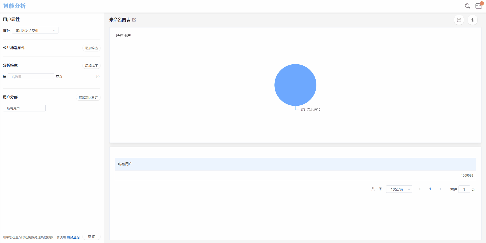
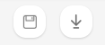

# 用户分析

用户分析，即以用户属性为分析维度，查看自有用户群体构成的分析模块。

## 用户分析界面概览

<b>用户分析界面概览</b>

## 查询条件配置方法

### 指标配置

<b>用户分析查询条件配置</b>

用户分析模块中，所有可选择的指标皆来自于用户属性，默认指标为用户数。同时，根据用户属性数据类型的不同，还可以选择其他用户属性的去重数、总和、最大值、最小值以及均值作为指标，指标只能选择一个。

<table>
    <tr>
        <th>用户属性数据类型</th>
        <th>可选指标</th>
    </tr>
    <tr>
        <td rowspan=5>数值类型</td>
        <td>总和</td>
    </tr>
    <tr>
        <td>最大值</td>
    </tr>
    <tr>
        <td>最小值</td>
    </tr>
    <tr>
        <td>均值</td>
    </tr>
    <tr>
        <td>去重数</td>
    </tr>
    <tr>
        <td>日期时间类型</td>
        <td>去重数</td>
    </tr>
    <tr>
        <td>布尔类型</td>
        <td>去重数</td>
    </tr>
    <tr>
        <td>字符串类型</td>
        <td>去重数</td>
    </tr>
</table>

> 用户数：所有用户数
>
> 总和：对此属性的属性值求和
>
> 最大值：取此属性所有值中的最大值
>
> 最小值：取此属性所有值中的最小值
>
> 均值：计算此属性所有值的算术平均值
>
> 去重数：对此属性的所有值进行去重后留下的独立属性值个数

### 公共筛选条件

<b>公共筛选条件</b>

用户分析中的公共筛选条件是对所选择的指标进行筛选，具体的筛选条件计算规则请参考[筛选条件](筛选条件.md)。

### 分析维度

<b>分析维度</b>

选择分析维度后，用户分析的查询结果将按照维度值分组展示，维度可选项来源于全部的用户属性。

执行查询后，用户分析的结果图表将同时展示所有分组的数据，详细的分析维度规则请参考[分析维度](分析维度.md)。

### 分析用户群

<b>分析用户群</b>

点击分析用户群下拉框，可以选择需要分析的特定用户群，此下拉框内的可选项来源于已经创建完成的用户分群，如何创建用户分群请参考[用户分群](用户分群.md)。

## 保存书签

<b>保存书签</b>

点击**保存**按钮后，可以将此次配置的查询条件保存为书签：

> 书签名称：必填项，该书签的名称。
>
> 同时添加至数据看板：可选项，选择具体的数据看板后，此次配置的查询条件将保存为书签同时在选择的数据看板内展示。如此选项留空，则只会保存为书签，后续可在书签管理模块管理此书签。

## 数据下载

<b>保存书签</b>

数据分析工作台支持将数据下载至本地进行二次应用，点击**下载**按钮后，查询得到的数据将以csv的格式下载至本地，下载进度可以在页面上方的消息中心查看。

